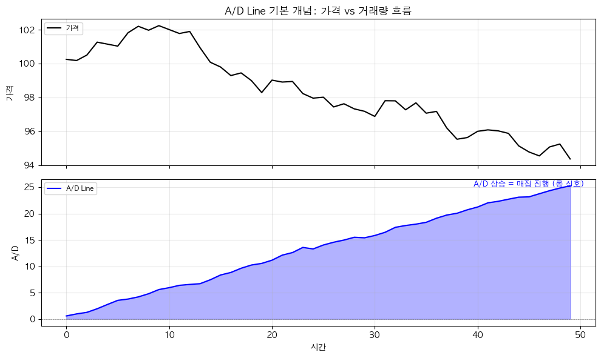
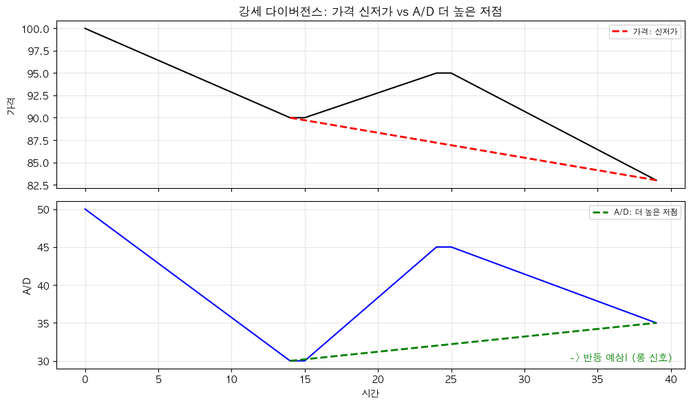

# 해외선물 A/D Line 매집/분산 전략 (Accumulation/Distribution for Futures)

## 전략 ID
`FuturesAD`

## 전략 기여자
ProgramGarden Team

## 간단한 설명

이 전략은 **"거래량이 고가 근처에서 많았는지, 저가 근처에서 많았는지"를 분석해서, 기관(스마트 머니)이 매집 중인지 분산 중인지 판단하는 도구**입니다.

A/D가 상승하면 **매집 진행 → 롱**, A/D가 하락하면 **분산 진행 → 숏**을 제안합니다. OBV와 유사하지만, **종가 위치를 고려**해서 더 정밀합니다.

## 📊 A/D Line 시각화

### 1. 기본 개념

A/D Line이 상승하면 **매집 진행 (롱 신호)**, 하락하면 **분산 진행 (숏 신호)**입니다.



### 2. 다이버전스 패턴

가격과 A/D가 다르게 움직일 때 추세 전환을 예고합니다.



## 이 전략이 필요한 이유

- 가격이 오르는데 **진짜 사는 사람이 많은 건지** 확인하고 싶을 때
- **기관의 움직임(스마트 머니)**을 추적하고 싶을 때
- OBV보다 **더 정교한 거래량 분석**이 필요할 때

## 전략 상세 설명

### 먼저, 용어를 간단히 정리해 볼게요

- **매집 (Accumulation)**
    - 세력이나 기관이 **조용히 모으는 중**입니다.
    - 가격은 횡보해도 A/D가 올라가면 매집 신호!
    - 나중에 가격이 **상승할 가능성**이 높습니다.

- **분산 (Distribution)**
    - 세력이나 기관이 **조용히 파는 중**입니다.
    - 가격은 유지해도 A/D가 내려가면 분산 신호!
    - 나중에 가격이 **하락할 가능성**이 높습니다.

- **Money Flow Multiplier (MFM)**
    - 종가가 당일 범위 중 **어디에서 형성됐는지** 측정합니다.
    - **+1에 가까움**: 고가 근처에서 마감 → 매수 우세
    - **-1에 가까움**: 저가 근처에서 마감 → 매도 우세
    - **0 근처**: 중간에서 마감 → 균형

- **A/D vs OBV**
    | | A/D Line | OBV |
    |---|----------|-----|
    | 거래량 처리 | 종가 위치로 가중치 | 전량 더하거나 빼기 |
    | 정밀도 | 높음 | 보통 |
    | 의미 | 거래량의 "질" | 거래량의 "양" |

### A/D 패턴 해석하기

| 가격 | A/D | 의미 |
| --- | --- | --- |
| **상승** | **상승** | 건강한 상승! 매집 진행 중 |
| **하락** | **하락** | 건강한 하락. 분산 진행 중 |
| **상승** | **하락** | ⚠️ 분산 중! 곧 하락 가능 |
| **하락** | **상승** | 🔥 매집 중! 곧 상승 가능 |
| **횡보** | **상승** | 조용한 매집. 상승 돌파 임박 |
| **횡보** | **하락** | 조용한 분산. 하락 돌파 임박 |

### 어떤 방식으로 포지션을 제안하나요?

| 상황 | 포지션 | 이유 |
| --- | --- | --- |
| **A/D > A/D 이동평균** | `long` (롱) | 매집 진행 중 |
| **A/D < A/D 이동평균** | `short` (숏) | 분산 진행 중 |
| **강세 다이버전스** | `long` (롱) | 반등 기대 |
| **약세 다이버전스** | `short` (숏) | 하락 기대 |

### 활용 시나리오

- 가격 상승이 **진짜인지 확인**하고 싶을 때
- **기관의 매집/분산 패턴**을 감지하고 싶을 때
- 귀금속/원자재 선물의 **수급 흐름**을 파악하고 싶을 때

## DSL 예시

```python
{
    "condition_id": "FuturesAD",
    "params": {
        "appkey": "발급받은 LS증권 키",
        "appsecretkey": "발급받은 LS증권 시크릿",
        "ma_period": 20,
        "divergence_lookback": 10,
        "timeframe": "days",
        "qrycnt": 200
    }
}
```

## 파라미터 설명

| 이름 | 타입 | 기본값 | 설명 |
| --- | --- | --- | --- |
| `appkey` | str | - | LS증권에서 발급받은 Open API 키입니다. |
| `appsecretkey` | str | - | LS증권에서 발급받은 Open API 시크릿입니다. |
| `ma_period` | int | 20 | A/D 이동평균 기간입니다. |
| `divergence_lookback` | int | 10 | 다이버전스 확인 기간입니다. |
| `timeframe` | str | "days" | 캔들 주기입니다. |
| `qrycnt` | int | 200 | 불러올 캔들 개수입니다. |

## 응답 데이터 설명

| 필드 | 설명 |
| --- | --- |
| `position_side` | **추천 포지션**입니다. `"long"`, `"short"`, `"flat"`, `"neutral"` 중 하나 |
| `trend` | 현재 추세입니다. `"accumulation"`, `"distribution"`, `"neutral"` |
| `divergence` | 다이버전스 유형입니다. `"bullish"`, `"bearish"`, `null` |
| `ad_line` | 현재 A/D 라인 값입니다. |
| `ad_ma` | A/D 이동평균 값입니다. |
| `money_flow_multiplier` | MFM 값 (-1 ~ +1) |

## Money Flow Multiplier 이해하기

```
MFM = ((종가 - 저가) - (고가 - 종가)) ÷ (고가 - 저가)

예시 1: 고가 $100, 저가 $90, 종가 $98
→ MFM = ((98-90) - (100-98)) / (100-90) = (8-2)/10 = +0.6
→ 고가 근처 마감 = 매수 우세!

예시 2: 고가 $100, 저가 $90, 종가 $92
→ MFM = ((92-90) - (100-92)) / (100-90) = (2-8)/10 = -0.6
→ 저가 근처 마감 = 매도 우세!
```

## 전략 활용 팁

1. **추세 확인**: 가격 상승 + A/D 상승 = 건강한 상승
2. **돌파 검증**: 가격 돌파 시 A/D도 같이 돌파하는지 확인
3. **MFM 참고**: MFM이 지속적으로 양수 → 매수세 강함
4. **OBV와 비교**: A/D와 OBV가 같은 방향 → 신호 신뢰도 높음

## 전략 사용 시 주의사항

- **갭 발생 시** A/D 계산이 왜곡될 수 있습니다 (분모가 0에 가까워짐).
- **거래량이 낮은 상품**에서는 신뢰도가 떨어집니다.
- A/D 절대값보다 **추세와 다이버전스**에 집중하세요.
- **장기 추세 확인**에 더 적합하며, 단기 매매에는 추가 확인이 필요합니다.
