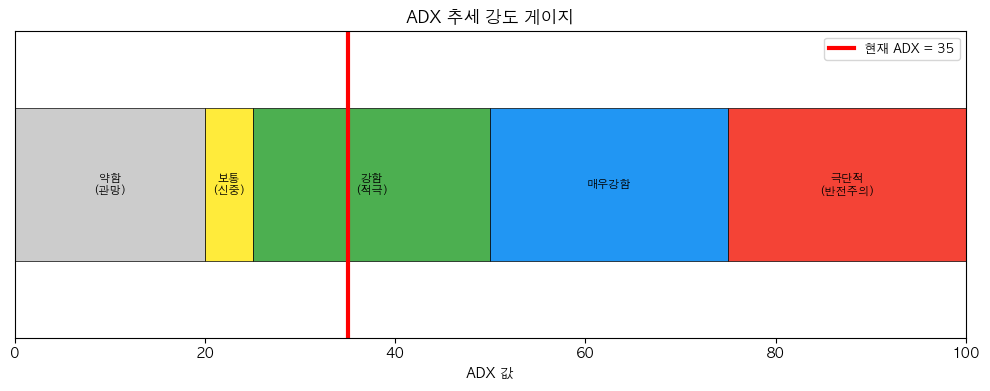

# 해외선물 ADX 추세 강도 전략 (Average Directional Index for Futures)

## 전략 ID
`FuturesADX`

## 전략 기여자
ProgramGarden Team

## 간단한 설명

이 전략은 **"지금 추세가 강한가, 약한가"를 측정하고, 추세 방향에 따라 롱 또는 숏을 추천하는 도구**입니다.

ADX가 25 이상이면 **추세가 강하다**고 보고, +DI가 -DI보다 높으면 **롱**, 낮으면 **숏**을 제안합니다. ADX가 20 미만이면 **추세가 없으니 관망**합니다.

## 📊 ADX 시각화

### 1. ADX 추세 강도 게이지

ADX 값이 높을수록 추세가 강합니다. 25 이상이면 추세 추종 전략 적합!



### 2. +DI/-DI 방향 지표

+DI > -DI면 **상승 추세 (롱)**, -DI > +DI면 **하락 추세 (숏)**입니다.


## 이 전략이 필요한 이유

- 선물 거래에서 **추세가 있을 때만 거래**하면 승률이 올라갑니다.
- "지금이 추세장인지 횡보장인지" 객관적으로 판단하기 어렵습니다.
- ADX를 사용하면 **"지금 추세 전략을 써도 되는지"** 를 숫자로 알 수 있습니다.

## 전략 상세 설명

### 먼저, 용어를 간단히 정리해 볼게요

- **ADX (Average Directional Index)**
    - **추세의 강도**를 0~100 사이 숫자로 나타냅니다.
    - 숫자가 높을수록 추세가 강하고, 낮을수록 추세가 약합니다.
    - **방향과 무관**합니다. 상승이든 하락이든 추세가 강하면 ADX가 높아집니다.

- **+DI (Positive Directional Indicator)**
    - **상승 방향의 힘**을 측정합니다.
    - +DI > -DI면 상승 압력이 우세 → **롱 포지션**

- **-DI (Negative Directional Indicator)**
    - **하락 방향의 힘**을 측정합니다.
    - -DI > +DI면 하락 압력이 우세 → **숏 포지션**

### ADX 값 해석하기

| ADX 값 | 추세 강도 | 권장 전략 |
| --- | --- | --- |
| **0 ~ 20** | 약함/없음 | 거래 회피, 관망 |
| **20 ~ 25** | 보통 | 신중한 진입 |
| **25 ~ 50** | 강함 | **추세 추종 적극!** |
| **50 ~ 75** | 매우 강함 | 추세 지속 기대 |
| **75 ~ 100** | 극단적 | 반전 가능성 주의 |

### 어떤 방식으로 포지션을 제안하나요?

| 상황 | 포지션 | 이유 |
| --- | --- | --- |
| **+DI > -DI & ADX ≥ 20** | `long` (롱) | 상승 추세가 우세 |
| **-DI > +DI & ADX ≥ 20** | `short` (숏) | 하락 추세가 우세 |
| **ADX < 20** | `flat` (관망) | 추세가 약해서 진입 부적합 |

### 활용 시나리오

- 해외선물에서 **추세 추종 전략**을 쓸 때, 진입 적합 시점 판단
- 다른 전략의 **필터**로 활용 (ADX > 25일 때만 신호 따르기)
- 추세가 **강해지는지 약해지는지** 모니터링

## DSL 예시

```python
{
    "condition_id": "FuturesADX",
    "params": {
        "appkey": "발급받은 LS증권 키",
        "appsecretkey": "발급받은 LS증권 시크릿",
        "period": 14,
        "strong_threshold": 25.0,
        "weak_threshold": 20.0,
        "timeframe": "days",
        "qrycnt": 200
    }
}
```

## 파라미터 설명

| 이름 | 타입 | 기본값 | 설명 |
| --- | --- | --- | --- |
| `appkey` | str | - | LS증권에서 발급받은 Open API 키입니다. |
| `appsecretkey` | str | - | LS증권에서 발급받은 Open API 시크릿입니다. |
| `period` | int | 14 | ADX 계산 기간입니다. 14일이 표준입니다. |
| `strong_threshold` | float | 25.0 | 이 값 이상이면 "추세가 강하다"고 판단합니다. |
| `weak_threshold` | float | 20.0 | 이 값 이하면 "추세가 약하다"고 판단합니다. |
| `timeframe` | str | "days" | 캔들 주기입니다. `"days"`, `"weeks"`, `"months"` 중 선택 |
| `qrycnt` | int | 200 | 불러올 캔들 개수입니다. |

## 응답 데이터 설명

| 필드 | 설명 |
| --- | --- |
| `position_side` | **추천 포지션**입니다. `"long"`, `"short"`, `"flat"`, `"neutral"` 중 하나 |
| `trend_strength` | 추세 강도입니다. `"strong"`, `"moderate"`, `"weak"` |
| `direction` | 추세 방향입니다. `"bullish"` (상승), `"bearish"` (하락) |
| `current.adx` | 현재 ADX 값입니다 (0~100). |
| `current.plus_di` | 현재 +DI 값입니다. |
| `current.minus_di` | 현재 -DI 값입니다. |

## 포지션 신호 해석 가이드

| 신호 | position_side | 의미 | 대응 |
| --- | --- | --- | --- |
| ADX > 25, +DI > -DI | `long` | 강한 상승 추세 | 롱 진입/유지 |
| ADX > 25, -DI > +DI | `short` | 강한 하락 추세 | 숏 진입/유지 |
| ADX < 20 | `flat` | 추세 없음 | 거래 자제 |
| ADX 상승 + DI 교차 | 신규 진입 | 새로운 추세 시작 | 중요한 진입점! |
| ADX 하락 | 청산 고려 | 추세 약화 | 이익 실현 검토 |

## 전략 활용 팁

1. **ADX + DI 조합**: ADX가 상승하면서 DI 크로스 발생 시 강한 신호!
2. **추세 필터**: 다른 전략 사용 시 ADX > 25일 때만 신호 따르기
3. **ADX 하락 시**: 추세 약화 신호, 포지션 청산 고려
4. **DI 크로스**: +DI가 -DI 상향 돌파 → 롱, -DI가 +DI 상향 돌파 → 숏

## 전략 사용 시 주의사항

- ADX는 **방향이 아닌 강도만** 측정합니다. 방향은 DI로 판단하세요.
- **ADX가 너무 높으면(50 이상)** 추세 끝물일 수 있습니다. 주의하세요.
- DI 크로스만으로 진입하지 말고, **ADX가 함께 상승하는지** 확인하세요.
- 횡보장(ADX < 20)에서 무리하게 진입하면 손실이 쌓입니다.
- 선물은 레버리지가 있으므로 **손절 관리가 필수**입니다.
