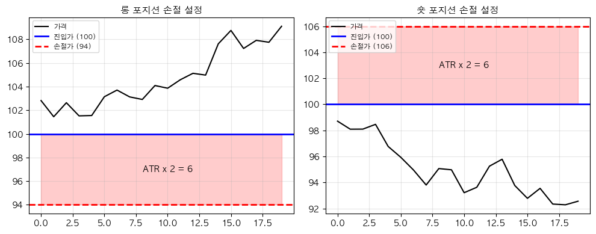
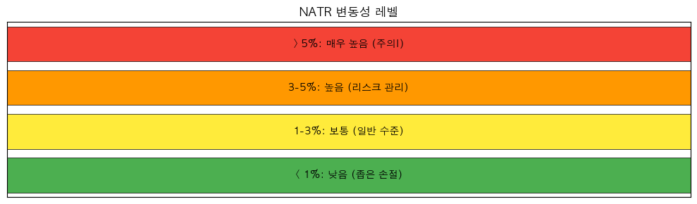

# 해외선물 ATR 변동성 전략 (Average True Range for Futures)

## 전략 ID
`FuturesATR`

## 전략 기여자
ProgramGarden Team

## 간단한 설명

이 전략은 **"지금 시장이 얼마나 출렁이고 있는지"를 측정해서, 적절한 손절 레벨과 포지션 크기를 계산해 주는 도구**입니다.

ATR이 크면 **"변동성이 높다 = 손절폭을 넓게"**, ATR이 작으면 **"변동성이 낮다 = 손절폭을 좁게"** 설정합니다. ATR은 방향을 알려주지 않지만, **리스크 관리의 필수 도구**입니다.

## 📊 ATR 시각화

### 1. ATR 기반 손절 설정

ATR을 활용하여 변동성에 맞는 손절가를 설정합니다.



### 2. 변동성 레벨 게이지

NATR(정규화 ATR)로 변동성 수준을 파악합니다.



## 이 전략이 필요한 이유

- 선물 거래에서 **손절 레벨을 어디에 설정할지** 막막할 때 유용합니다.
- 변동성이 클 때 **포지션 크기를 줄여서** 리스크를 관리할 수 있습니다.
- **다른 상품과 변동성을 비교**해서 어떤 상품을 거래할지 결정할 수 있습니다.

## 전략 상세 설명

### 먼저, 용어를 간단히 정리해 볼게요

- **True Range (실제 범위)**
    - 오늘 고가-저가, 어제 종가-오늘 고가, 어제 종가-오늘 저가 중 가장 큰 값
    - 갭을 포함한 실제 변동폭을 측정합니다.

- **ATR (Average True Range)**
    - True Range의 n일 평균입니다.
    - 단위: 가격 (예: $0.35, 2포인트 등)
    - **ATR이 크다** = 변동성이 높다
    - **ATR이 작다** = 변동성이 낮다

- **NATR (Normalized ATR)**
    - ATR을 종가로 나눈 백분율입니다.
    - **다른 상품과 변동성을 비교**할 때 사용합니다.
    - 예: 금 NATR 0.8%, 천연가스 NATR 5%

- **손절 배수 (Stop Multiplier)**
    - ATR의 몇 배로 손절을 설정할지입니다.
    - 예: ATR 2배 → 변동성의 2배만큼 여유를 둠

### ATR 값 해석하기

| NATR 값 | 변동성 | 의미 |
| --- | --- | --- |
| **> 5%** | 매우 높음 | 하루에 5% 이상 움직일 수 있음 |
| **3~5%** | 높음 | 적극적 리스크 관리 필요 |
| **1~3%** | 보통 | 일반적 수준 |
| **< 1%** | 낮음 | 변동성이 작은 상태 |

### 어떤 방식으로 정보를 제공하나요?

| 정보 | 설명 |
| --- | --- |
| `atr` | 현재 ATR 값 (가격 단위) |
| `natr` | 정규화 ATR (%, 비교용) |
| `volatility_level` | 변동성 수준 (high/normal/low) |
| `suggested_stop` | 제안 손절폭 (ATR × 배수) |

⚠️ **ATR은 롱/숏 방향을 알려주지 않습니다.** 변동성만 측정하는 지표이므로, EMA나 MACD 같은 방향성 전략과 함께 사용하세요.

### 활용 시나리오

- **손절 레벨** 설정: 진입가 ± (ATR × 2)로 자동 계산
- **포지션 사이징**: 변동성이 높으면 포지션 축소
- **상품 비교**: NATR로 어떤 선물이 더 위험한지 비교
- **브레이크아웃 대기**: ATR 축소(스퀴즈) 후 큰 움직임 대비

## DSL 예시

```python
{
    "condition_id": "FuturesATR",
    "params": {
        "appkey": "발급받은 LS증권 키",
        "appsecretkey": "발급받은 LS증권 시크릿",
        "period": 14,
        "stop_multiplier": 2.0,
        "volatility_high_threshold": 1.5,
        "volatility_low_threshold": 0.7,
        "timeframe": "days",
        "qrycnt": 200
    }
}
```

## 파라미터 설명

| 이름 | 타입 | 기본값 | 설명 |
| --- | --- | --- | --- |
| `appkey` | str | - | LS증권에서 발급받은 Open API 키입니다. |
| `appsecretkey` | str | - | LS증권에서 발급받은 Open API 시크릿입니다. |
| `period` | int | 14 | ATR 계산 기간입니다. |
| `stop_multiplier` | float | 2.0 | 손절 ATR 배수입니다. |
| `volatility_high_threshold` | float | 1.5 | 높은 변동성 판단 배수입니다. |
| `volatility_low_threshold` | float | 0.7 | 낮은 변동성 판단 배수입니다. |
| `timeframe` | str | "days" | 캔들 주기입니다. |
| `qrycnt` | int | 200 | 불러올 캔들 개수입니다. |

## 응답 데이터 설명

| 필드 | 설명 |
| --- | --- |
| `volatility_level` | 변동성 수준입니다. `"high"`, `"normal"`, `"low"` |
| `atr` | 현재 ATR 값 (가격 단위) |
| `natr` | 정규화 ATR (%, 상품 비교용) |
| `suggested_stop` | 제안 손절폭 (ATR × 배수) |
| `current.true_range` | 당일 True Range 값 |

## ATR 활용 공식

### 1. 손절 레벨 계산
```
롱 포지션 손절가 = 진입가 - (ATR × 배수)
숏 포지션 손절가 = 진입가 + (ATR × 배수)

예: 금 진입가 $2700, ATR $20, 배수 2
→ 롱 손절가 = $2700 - ($20 × 2) = $2660
```

### 2. 포지션 사이징
```
포지션 크기 = 리스크 금액 ÷ (ATR × 배수)

예: 리스크 $1000, ATR $20, 배수 2
→ 포지션 = $1000 ÷ $40 = 25단위
```

## 변동성 높은 선물 예시

| 상품 | 심볼 | 특징 |
| --- | --- | --- |
| 천연가스 | NG=F | 매우 높은 변동성 |
| 원유 | CL=F | 높은 변동성 |
| 비트코인 | BTC=F | 극히 높은 변동성 |
| 금 | GC=F | 중간 변동성 |
| 지수 선물 | ES=F, NQ=F | 보통 변동성 |

## 전략 활용 팁

1. **변동성 확대 시**: 포지션 크기 축소, 손절폭 확대
2. **변동성 축소 시**: "스퀴즈" 패턴 → 큰 움직임 전조일 수 있음
3. **트레일링 스탑**: 가격이 유리하게 움직이면 ATR 단위로 손절 조정
4. **리스크 동일화**: ATR로 여러 상품의 리스크를 동일하게 맞출 수 있음

## 전략 사용 시 주의사항

- ATR은 **방향을 알려주지 않습니다**. 다른 추세 지표와 함께 사용하세요.
- **갭 발생 시** ATR이 급증할 수 있습니다 (정상적인 현상).
- 선물의 **틱 가치**를 고려해서 손절 금액을 계산하세요.
- 변동성이 갑자기 높아지면 **기존 포지션 리스크를 재점검**하세요.
