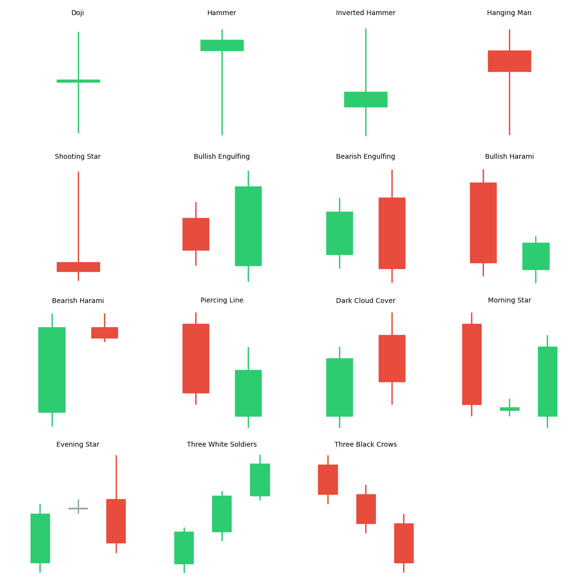

# 해외선물 캔들스틱 패턴 전략 (Candlestick Patterns for Futures)

## 전략 ID
`FuturesCandlePatterns`

## 전략 기여자
ProgramGarden Team

## 간단한 설명

이 전략은 **"캔들(봉) 모양만 보고 앞으로 오를지 내릴지"를 예측하는 전통적인 기술적 분석 기반 전략 조건**입니다.

일본에서 유래한 방법으로, 토글 가능한 **14개 감지 키**(집게형 포함)에서 파생되는 **총 17개 패턴**(강세/약세 변형 포함)을 자동 인식하여 롱/숏 신호를 반환합니다. 예를 들어 "해머" 패턴이 나오면 반등을, "유성" 패턴이 나오면 하락을 기대합니다.

## 캔들스틱 패턴 참고 이미지

각 패턴의 모양과 의미를 한눈에 파악할 수 있습니다.



## 이 전략이 필요한 이유

- **차트만 보고 판단**하고 싶을 때 유용합니다.
- 복잡한 계산 없이 **패턴 인식만으로** 진입 타이밍을 잡을 수 있습니다.
- 수백 년간 검증된 **전통적 기법**입니다.

## 전략 상세 설명

### 먼저, 용어를 간단히 정리해 볼게요

- **캔들스틱 (봉)**
    - 시가, 고가, 저가, 종가를 하나의 모양으로 표현한 것입니다.
    - **양봉(상승)**: 시가 < 종가 (보통 빨간색/흰색)
    - **음봉(하락)**: 시가 > 종가 (보통 파란색/검은색)

- **몸통 (Body)**
    - 시가와 종가 사이의 두꺼운 부분입니다.
    - 몸통이 크면 강한 움직임을 의미합니다.

- **꼬리/그림자 (Shadow/Wick)**
    - 몸통 위아래의 가느다란 선입니다.
    - 윗꼬리: 고가까지 올랐다가 밀린 흔적
    - 아랫꼬리: 저가까지 내렸다가 반등한 흔적

### 지원하는 패턴 목록

> 💡 `patterns_to_detect` 파라미터에 아래 **키** 값을 배열로 넣어 원하는 패턴만 감지할 수 있습니다.

#### 📌 단일 캔들 패턴 (1봉)

| 키 | 패턴 | 타입 | 모양 설명 |
| --- | --- | --- | --- |
| `doji` | **도지 (Doji)** | 중립 | 시가=종가, 십자 모양. "어디로 갈지 모르겠어요" |
| `hammer` | **해머 (Hammer)** | 강세🔼 | 긴 아랫꼬리 + 짧은 몸통. "바닥을 찍고 반등!" |
| `inverted_hammer` | **역해머 (Inverted Hammer)** | 강세🔼 | 긴 윗꼬리 + 짧은 몸통. "상승 시도 중" |
| `hanging_man` | **행잉맨 (Hanging Man)** | 약세🔽 | 상승 후 해머 모양. "매달린 사람 = 위험!" |
| `shooting_star` | **유성 (Shooting Star)** | 약세🔽 | 상승 후 긴 윗꼬리. "별똥별처럼 떨어질 수 있어요" |

#### 📌 2봉 패턴

| 키 | 패턴 | 타입 | 모양 설명 |
| --- | --- | --- | --- |
| `engulfing` | **장악형 (Engulfing)** | 강세/약세 | 이전 봉을 완전히 감싸는 큰 봉. "세력 장악!" |
| `harami` | **하라미 (Harami)** | 강세/약세 | 큰 봉 안에 작은 봉. "임신한 것처럼 새 생명" |
| `piercing_line` | **관통형 (Piercing Line)** | 강세🔼 | 갭다운 후 중간 이상 회복. "뚫고 올라온다!" |
| `dark_cloud_cover` | **먹구름형 (Dark Cloud Cover)** | 약세🔽 | 갭업 후 중간 이하 하락. "먹구름이 끼고 있어요" |
| `tweezer` | **집게형 (Tweezer)** | 강세/약세 | 고점/저점이 동일한 두 봉. 천정 또는 바닥 신호 |

#### 📌 3봉 패턴

| 키 | 패턴 | 타입 | 모양 설명 |
| --- | --- | --- | --- |
| `morning_star` | **샛별형 (Morning Star)** | 강세🔼 | 큰 음봉 + 작은 봉 + 큰 양봉. "새벽별이 떴다 = 상승!" |
| `evening_star` | **석별형 (Evening Star)** | 약세🔽 | 큰 양봉 + 작은 봉 + 큰 음봉. "저녁별이 뜨면 밤이 온다" |
| `three_white_soldiers` | **세 병정 (Three White Soldiers)** | 강세🔼 | 연속 3개의 상승 양봉. "병사들이 전진!" |
| `three_black_crows` | **세 까마귀 (Three Black Crows)** | 약세🔽 | 연속 3개의 하락 음봉. "까마귀가 울면 불길" |

### 신뢰도(Confidence)란?

패턴이 얼마나 **교과서적으로 형성됐는지**를 0~1 사이 숫자로 표현합니다.

| 신뢰도 | 의미 | 권장 행동 |
| --- | --- | --- |
| **0.9~1.0** | 매우 높음 | 적극적으로 신호 활용 |
| **0.7~0.9** | 높음 | 신뢰할 수 있음 |
| **0.5~0.7** | 보통 | 다른 지표로 확인 필요 |
| **< 0.5** | 낮음 | 참고만 하세요 |

## DSL 예시

```python
{
    "condition_id": "FuturesCandlePatterns",
    "params": {
        "appkey": "발급받은 LS증권 키",
        "appsecretkey": "발급받은 LS증권 시크릿",
        "min_confidence": 0.6,
        "patterns_to_detect": ["hammer", "engulfing", "morning_star", "evening_star"],
        "timeframe": "days",
        "qrycnt": 100
    }
}
```

## 파라미터 설명

| 이름 | 타입 | 기본값 | 설명 |
| --- | --- | --- | --- |
| `appkey` | str | - | LS증권에서 발급받은 Open API 키입니다. |
| `appsecretkey` | str | - | LS증권에서 발급받은 Open API 시크릿입니다. |
| `min_confidence` | float | 0.6 | 최소 신뢰도입니다. 이 이상만 인식합니다. |
| `patterns_to_detect` | list | 전체 | 감지할 패턴 목록입니다. 위 "지원하는 패턴 목록"의 **키** 값 참조. |
| `timeframe` | str | "days" | 캔들 주기입니다. |
| `qrycnt` | int | 100 | 불러올 캔들 개수입니다. |

## 응답 데이터 설명

| 필드 | 설명 |
| --- | --- |
| `position_side` | **추천 포지션**입니다. `"long"`, `"short"`, `"flat"`, `"neutral"` 중 하나 |
| `bullish_count` | 발견된 강세 패턴 개수 |
| `bearish_count` | 발견된 약세 패턴 개수 |
| `recent_pattern` | 가장 최근에 발견된 패턴 정보 |
| `recent_pattern.pattern_name` | 패턴 이름 |
| `recent_pattern.confidence` | 패턴 신뢰도 (0~1) |
| `patterns` | 발견된 모든 패턴 목록 |


## 전략 활용 팁

1. **추세 맥락**: 상승 추세에서 강세 패턴이 더 신뢰성 높음
2. **지지/저항**: 주요 레벨에서 발생한 패턴이 더 의미 있음
3. **거래량 확인**: 패턴 발생 시 거래량도 같이 증가했는지 확인
4. **확인 캔들**: 패턴 다음 봉이 방향을 확인해주면 신뢰도 상승

## 전략 사용 시 주의사항

- 캔들스틱 패턴만으로 **거래 결정을 내리지 마세요**.
- 다른 기술적 지표(MA, RSI 등)와 **함께 사용**하세요.
- 선물 시장의 **높은 변동성**을 고려하세요.
