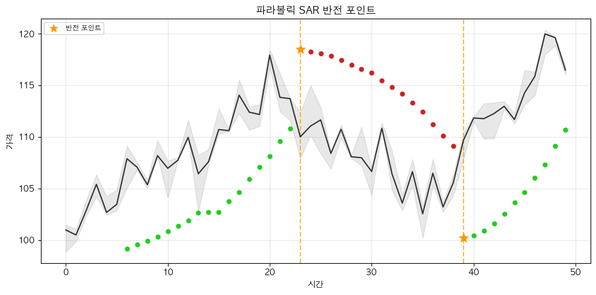
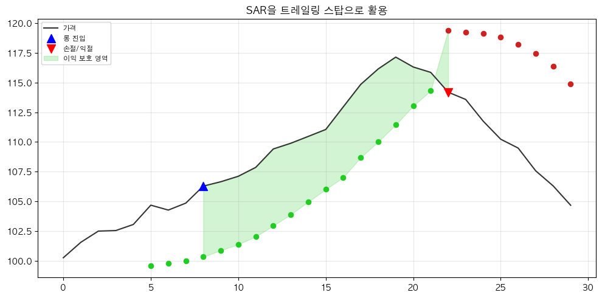

# 해외선물 파라볼릭 SAR 전략 (Parabolic SAR for Futures)

## 전략 ID
`FuturesParabolicSAR`

## 전략 기여자
ProgramGarden Team

## 간단한 설명

이 전략은 **"지금이 상승 추세인지 하락 추세인지"를 자동으로 판단해서, 롱(매수) 또는 숏(매도) 포지션을 추천하는 도구**입니다.

차트에서 가격 아래에 점이 있으면 **상승 추세 → 롱**, 가격 위에 점이 있으면 **하락 추세 → 숏**을 제안합니다. 점의 위치가 바뀌는 순간(반전)이 포지션 전환 시점입니다.

## 📊 파라볼릭 SAR 시각화

### 1. 기본 개념

SAR 점이 가격 아래에 있으면 **상승 추세(롱)**, 가격 위에 있으면 **하락 추세(숏)**입니다.


### 2. 반전(Reversal) 포인트

SAR 점의 위치가 바뀌는 순간이 **추세 전환 신호**입니다.



### 3. 가속 계수(AF) 작동 원리

추세가 지속될수록 AF가 증가하여 SAR이 가격에 더 빠르게 접근합니다.


### 4. SAR을 트레일링 스탑으로 활용

SAR 값을 손절선으로 사용하면 추세를 따라가면서 이익을 보호할 수 있습니다.



## 이 전략이 필요한 이유

- 선물 거래에서는 **추세를 따라가는 것**이 기본 전략입니다.
- 하지만 "지금 추세가 뭔지", "언제 추세가 바뀌는지" 판단하기 어렵습니다.
- 파라볼릭 SAR은 **자동으로 추세를 따라가면서** 손절선까지 제공해 줍니다.

## 전략 상세 설명

### 먼저, 용어를 간단히 정리해 볼게요

- **SAR (Stop And Reverse)**
    - 차트에 점으로 표시되는 값입니다.
    - "이 점을 가격이 터치하면 추세가 바뀐다"라는 의미입니다.
    - SAR 값을 **손절선**으로 활용할 수 있습니다.

- **상승 추세 (Bullish)**
    - SAR 점이 **가격 아래**에 있을 때입니다.
    - **롱 포지션**을 추천합니다.

- **하락 추세 (Bearish)**
    - SAR 점이 **가격 위**에 있을 때입니다.
    - **숏 포지션**을 추천합니다.

- **반전 (Reversal)**
    - SAR 점의 위치가 바뀌는 순간입니다.
    - 예: 점이 아래에 있다가 위로 올라가면 → 롱에서 숏으로 전환 신호

- **가속 계수 (AF, Acceleration Factor)**
    - SAR이 가격에 얼마나 빨리 접근하는지를 결정합니다.
    - 추세가 지속되면 AF가 증가해서 SAR이 빨리 따라옵니다.

### 어떤 방식으로 포지션을 제안하나요?

| 상황 | 포지션 | 이유 |
| --- | --- | --- |
| **SAR이 가격 아래** | `long` (롱) | 상승 추세, 가격 상승 시 수익 |
| **SAR이 가격 위** | `short` (숏) | 하락 추세, 가격 하락 시 수익 |
| **반전 발생** | 포지션 전환 | 기존 포지션 청산 후 반대 방향 진입 |

### 활용 시나리오

- 해외선물에서 **추세 추종 매매**를 하고 싶을 때
- **자동 손절선**을 설정하고 싶을 때 (SAR 값 활용)
- 추세가 **언제 끝나는지** 포착하고 싶을 때

## DSL 예시

```python
{
    "condition_id": "FuturesParabolicSAR",
    "params": {
        "appkey": "발급받은 LS증권 키",
        "appsecretkey": "발급받은 LS증권 시크릿",
        "af_start": 0.02,
        "af_increment": 0.02,
        "af_max": 0.2,
        "timeframe": "days",
        "qrycnt": 200
    }
}
```

## 파라미터 설명

| 이름 | 타입 | 기본값 | 설명 |
| --- | --- | --- | --- |
| `appkey` | str | - | LS증권에서 발급받은 Open API 키입니다. |
| `appsecretkey` | str | - | LS증권에서 발급받은 Open API 시크릿입니다. |
| `af_start` | float | 0.02 | 가속 계수 시작값입니다. 작을수록 SAR이 천천히 따라옵니다. |
| `af_increment` | float | 0.02 | 신고/신저 갱신 시 AF 증가량입니다. |
| `af_max` | float | 0.2 | 가속 계수 최대값입니다. |
| `timeframe` | str | "days" | 캔들 주기입니다. `"days"`, `"weeks"`, `"months"` 중 선택 |
| `qrycnt` | int | 200 | 불러올 캔들 개수입니다. |

## 응답 데이터 설명

| 필드 | 설명 |
| --- | --- |
| `position_side` | **추천 포지션**입니다. `"long"`, `"short"`, `"flat"`, `"neutral"` 중 하나 |
| `trend` | 현재 추세입니다. `"bullish"` (상승), `"bearish"` (하락) |
| `recent_reversals` | 최근 기간 내 반전 횟수입니다. 많으면 횡보장 가능성 |
| `current.sar` | 현재 SAR 값입니다. 이 값을 손절선으로 활용할 수 있습니다. |
| `current.af` | 현재 가속 계수 값입니다. |
| `current.ep` | 현재 극값(최고가 또는 최저가)입니다. |
| `current.reversal` | 방금 반전이 발생했는지 여부입니다. |

## 포지션 신호 해석 가이드

| 신호 | position_side | 의미 | 대응 |
| --- | --- | --- | --- |
| SAR < 가격 | `long` | 상승 추세, 롱 포지션 | SAR을 손절선으로 사용 |
| SAR > 가격 | `short` | 하락 추세, 숏 포지션 | SAR을 손절선으로 사용 |
| 반전 발생 | 포지션 전환 | 추세 전환! | 기존 청산 → 반대 방향 진입 |

## 전략 활용 팁

1. **추세 추종**: SAR 방향에 맞춰 포지션을 유지합니다.
2. **손절 설정**: SAR 값을 스탑로스로 활용합니다. SAR 터치 시 자동 청산.
3. **반전 대응**: `reversal=true`일 때 포지션 전환을 검토합니다.
4. **ADX 병행**: ADX로 추세 강도를 확인하면 더 효과적입니다.

## 전략 사용 시 주의사항

- **횡보장에서는 휩쏘(Whipsaw)**가 발생합니다. 잦은 반전으로 손실이 쌓일 수 있습니다.
- `recent_reversals`가 높으면 횡보장일 가능성이 높으니, 진입을 피하거나 다른 전략을 사용하세요.
- AF 값을 크게 설정하면 SAR이 빨리 따라오지만, **거짓 신호도 늘어납니다**.
- **ADX가 25 이상일 때만** 이 전략을 사용하면 휩쏘를 줄일 수 있습니다.
- 선물은 레버리지가 있으므로 **손절 관리가 필수**입니다.
