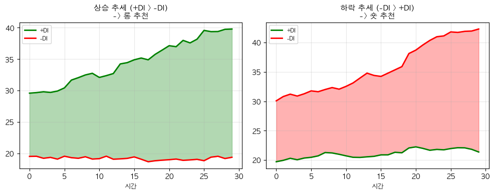

# 해외주식 ADX 추세 강도 전략 (Average Directional Index)

## 전략 ID
`ADX`

## 전략 기여자
ProgramGarden Team

## 간단한 설명

이 전략은 **"지금 추세가 강한가, 약한가"를 숫자로 알려주는 도구**입니다.

주의할 점은, ADX는 **방향을 알려주지 않습니다**. "상승인지 하락인지"가 아니라 **"추세가 얼마나 강한지"**만 측정합니다. 추세 방향은 함께 계산되는 +DI와 -DI로 판단합니다.

## 📊 ADX 시각화

### 1. ADX 추세 강도 게이지

ADX 값이 높을수록 추세가 강합니다. 25 이상이면 추세 추종 전략 적합!


### 2. +DI/-DI 방향 지표

+DI > -DI면 **상승 추세 (롱)**, -DI > +DI면 **하락 추세 (숏)**입니다.



## 이 전략이 필요한 이유

- 많은 전략이 **추세장에서는 잘 작동하지만 횡보장에서는 손실**을 냅니다.
- "지금이 추세장인지 횡보장인지" 판단이 어렵습니다.
- ADX를 사용하면 **"지금 추세 추종 전략을 써도 되는지"**를 객관적으로 판단할 수 있습니다.
- ADX가 낮으면 추세 전략을 쉬고, ADX가 높으면 적극적으로 추세를 따라갈 수 있습니다.

## 전략 상세 설명

### 먼저, 용어를 간단히 정리해 볼게요

- **ADX (Average Directional Index)**
    - **추세의 강도**를 0~100 사이 숫자로 나타냅니다.
    - 숫자가 높을수록 추세가 강하고, 낮을수록 추세가 약합니다.
    - 중요: ADX는 **방향과 무관**합니다. 상승이든 하락이든 추세가 강하면 ADX가 높아집니다.

- **+DI (Positive Directional Indicator)**
    - **상승 방향의 힘**을 측정합니다.
    - +DI가 높을수록 상승 압력이 강합니다.

- **-DI (Negative Directional Indicator)**
    - **하락 방향의 힘**을 측정합니다.
    - -DI가 높을수록 하락 압력이 강합니다.

- **DI 교차 (DI Cross)**
    - +DI가 -DI 위로 올라가면: **상승 추세 시작 신호**
    - -DI가 +DI 위로 올라가면: **하락 추세 시작 신호**
    - 이때 ADX도 상승하면 신호의 신뢰도가 높아집니다.

- **True Range (TR)**
    - 하루 동안 가격이 실제로 움직인 범위입니다.
    - 갭(전일 종가와 당일 시가 차이)까지 포함해서 계산합니다.

### ADX 숫자 해석하기

| ADX 값 | 추세 강도 | 의미 |
| --- | --- | --- |
| **0 ~ 20** | 약함 | 추세 없음, 횡보장. 추세 추종 전략 피하기 |
| **20 ~ 25** | 약함 ~ 보통 | 추세가 막 시작될 수도 있음, 관망 |
| **25 ~ 50** | 보통 ~ 강함 | **추세가 진행 중!** 추세 추종 전략 적합 |
| **50 ~ 75** | 매우 강함 | 강한 추세, 하지만 과열 가능성도 있음 |
| **75 ~ 100** | 극도로 강함 | 매우 드문 경우, 추세 끝물일 수 있음 |

### 어떤 방식으로 동작하나요?

1. **데이터 수집**
    - LS증권 OpenAPI에서 제공하는 가격 데이터를 활용합니다.

2. **+DM, -DM 계산**
    - 오늘 고점이 어제 고점보다 높으면 상승 움직임(+DM)
    - 오늘 저점이 어제 저점보다 낮으면 하락 움직임(-DM)

3. **+DI, -DI 계산**
    - +DM과 -DM을 True Range로 나눠서 정규화합니다.
    - 결과는 0~100 사이 값입니다.

4. **ADX 계산**
    - +DI와 -DI의 차이를 바탕으로 DX를 계산하고, 이를 평활화해서 ADX를 구합니다.

5. **신호 판단**
    - ADX가 임계값(기본 25) 이상이면 **추세가 강함**
    - +DI > -DI이면 **상승 추세**, -DI > +DI이면 **하락 추세**

### 방향성은 이렇게 해석하세요

- **추세장 진입 (ADX > 25)**
    - ADX가 25 이상이면 **"추세가 살아있다"**고 봅니다.
    - 이때 +DI > -DI이면 상승 추세 → 매수 고려
    - 이때 -DI > +DI이면 하락 추세 → 매도 또는 관망

- **횡보장 (ADX < 20)**
    - ADX가 20 미만이면 **"추세가 없다"**고 봅니다.
    - 추세 추종 전략은 쉬고, 레인지 매매를 고려합니다.

- **DI 교차 매매**
    - +DI가 -DI를 상향 돌파 + ADX 상승 → 강한 매수 신호
    - -DI가 +DI를 상향 돌파 + ADX 상승 → 강한 매도 신호

### 활용 시나리오

- 이동평균 골든크로스 같은 추세 전략을 쓰고 있는데, **횡보장에서 손실이 잦을 때** → ADX가 25 이상일 때만 전략 실행
- 여러 종목 중 **추세가 강한 종목만** 골라서 투자하고 싶을 때 → ADX로 스크리닝
- **추세의 시작을 포착**하고 싶을 때 → ADX가 20 밑에서 위로 올라오고 DI 교차 발생 시

## DSL 예시

```python
{
    "condition_id": "ADX",
    "params": {
        "appkey": "발급받은 LS증권 키",
        "appsecretkey": "발급받은 LS증권 시크릿",
        "period": 14,
        "strong_threshold": 25.0,
        "very_strong_threshold": 50.0,
        "timeframe": "days",
        "qrycnt": 200
    }
}
```

## 파라미터 설명

| 이름 | 타입 | 기본값 | 설명 |
| --- | --- | --- | --- |
| `appkey` | str | - | LS증권에서 발급받은 Open API 키입니다. |
| `appsecretkey` | str | - | LS증권에서 발급받은 Open API 시크릿입니다. |
| `period` | int | 14 | ADX 계산 기간입니다. 14일이 표준이며, 짧게 하면 민감해집니다. |
| `strong_threshold` | float | 25.0 | 이 값 이상이면 "추세가 강하다"고 판단합니다. |
| `very_strong_threshold` | float | 50.0 | 이 값 이상이면 "추세가 매우 강하다"고 판단합니다. |
| `timeframe` | str | "days" | 캔들 주기입니다. `"days"`, `"weeks"`, `"months"` 중 선택 |
| `qrycnt` | int | 200 | 불러올 캔들 개수입니다. |

## 응답 데이터 설명

| 필드 | 설명 |
| --- | --- |
| `trend_strength` | 추세 강도 레벨입니다. `"weak"`, `"moderate"`, `"strong"`, `"very_strong"` |
| `trend_direction` | 추세 방향입니다. `"bullish"` (상승), `"bearish"` (하락) |
| `adx` | 현재 ADX 값입니다 (0~100). |
| `plus_di` | 현재 +DI 값입니다. |
| `minus_di` | 현재 -DI 값입니다. |
| `di_cross` | DI 교차 상태입니다. `"bullish_cross"`, `"bearish_cross"`, `"none"` |
| `adx_rising` | ADX가 상승 중인지 여부입니다. 상승 중이면 추세가 강해지는 중. |

## 신호 해석 가이드

| 상황 | 해석 | 대응 |
| --- | --- | --- |
| ADX > 25, +DI > -DI | 강한 상승 추세 | 매수 또는 보유 |
| ADX > 25, -DI > +DI | 강한 하락 추세 | 매도 또는 관망 |
| ADX < 20 | 추세 없음 (횡보) | 추세 전략 쉬기, 레인지 매매 고려 |
| ADX 상승 + DI 교차 | 새로운 추세 시작 | 중요한 진입 시점! |
| ADX 하락 | 추세가 약해지는 중 | 이익 실현 고려 |

## ADX 활용 전략

### 1. 추세 필터로 활용
다른 매매 전략(이동평균, MACD 등)을 사용할 때, **ADX > 25일 때만** 신호를 따르면 승률이 올라갑니다.

### 2. 횡보장 감지
ADX < 20이면 횡보장이므로, **추세 추종 전략 대신 지지/저항 매매**를 고려합니다.

### 3. 추세 시작 포착
ADX가 20 아래에서 위로 올라오면서 +DI가 -DI를 돌파하면, **강력한 매수 신호**입니다.

## 전략 사용 시 주의사항

- ADX는 **후행 지표**입니다. 추세가 시작된 후에 ADX가 올라갑니다.
- ADX가 높다고 무조건 좋은 것은 아닙니다. **너무 높으면(50 이상) 추세 끝물**일 수 있습니다.
- DI 교차만으로 매매하지 말고, **ADX가 함께 상승하는지** 확인하세요.
- ADX가 떨어지기 시작하면 **추세가 약해지는 신호**입니다. 이익 실현을 고려하세요.
- 변동성이 낮은 종목은 ADX가 낮게 나올 수 있습니다. 종목 특성을 감안하세요.
