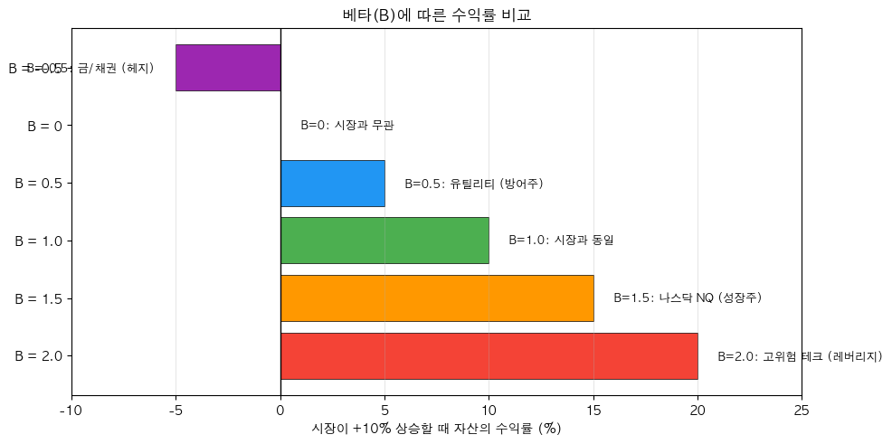

# 해외주식 베타 분석 전략 (Beta Analysis)

## 전략 ID
`Beta`

## 전략 기여자
ProgramGarden Team

## 간단한 설명

이 전략은 **"이 종목이 시장 대비 얼마나 민감하게 움직이는지"를 숫자로 알려주는 도구**입니다.

베타(β)가 1보다 크면 **시장보다 더 크게 움직이고** (공격적), 1보다 작으면 **시장보다 덜 움직입니다** (방어적). 포트폴리오의 리스크를 관리하고, 시장 상황에 맞는 종목을 선택하는 데 핵심적인 지표입니다.

## 📊 베타 시각화

### 베타에 따른 수익률 비교

시장이 +10% 상승할 때, 베타에 따라 자산의 수익률이 달라집니다.



## 이 전략이 필요한 이유

- **시장이 오르면** 어떤 종목은 더 많이 오르고, 어떤 종목은 덜 오릅니다.
- **시장이 내리면** 어떤 종목은 더 많이 내리고, 어떤 종목은 덜 내립니다.
- 베타를 알면:
    - 공격적으로 투자하고 싶을 때 → **베타가 높은 종목** 선택
    - 방어적으로 투자하고 싶을 때 → **베타가 낮은 종목** 선택
    - 포트폴리오 전체 리스크를 **원하는 수준으로 조절** 가능

## 전략 상세 설명

### 먼저, 용어를 간단히 정리해 볼게요

- **베타 (Beta, β)**
    - "시장이 1% 움직일 때 이 종목은 몇 % 움직이는가"를 나타냅니다.
    - **β = 1**: 시장과 같은 크기로 움직임
    - **β = 1.5**: 시장이 1% 오르면 1.5% 오름 (시장이 1% 내리면 1.5% 내림)
    - **β = 0.5**: 시장이 1% 오르면 0.5% 오름 (더 안정적)
    - **β < 0**: 시장과 반대로 움직임 (매우 드묾)

- **벤치마크 (Benchmark)**
    - 시장 전체를 대표하는 지수입니다.
    - 미국 주식은 보통 **SPY** (S&P 500 ETF)를 사용합니다.
    - 이 종목의 수익률과 벤치마크 수익률을 비교해서 베타를 계산합니다.

> 💡 **왜 벤치마크가 별도로 필요한가요?**
> 
> 다른 지표들(AD, ADX, ATR, CCI 등)은 **해당 종목의 데이터만** 분석합니다.
> 하지만 베타는 **"이 종목이 시장 대비 얼마나 민감한가?"** 를 측정하므로,
> 반드시 **비교 기준이 되는 시장 지수(벤치마크)** 데이터가 필요합니다.
> 
> | 지표 | 분석 방식 | 벤치마크 필요 |
> |------|----------|--------------|
> | AD, ADX, ATR | 해당 종목 자체 분석 | ❌ 불필요 |
> | **Beta** | 종목 vs 시장 비교 | ✅ **필요** |

- **상관계수 (Correlation)**
    - 두 종목이 **같은 방향으로 움직이는 정도**입니다.
    - +1: 완벽하게 같은 방향
    - 0: 관계 없음
    - -1: 완벽하게 반대 방향

- **공격적 종목 (Aggressive)**
    - 베타가 높은 종목입니다 (보통 1.2 이상).
    - 시장보다 크게 움직여서 **고위험 고수익**입니다.
    - 예: 테슬라(TSLA), 고성장 기술주

- **방어적 종목 (Defensive)**
    - 베타가 낮은 종목입니다 (보통 0.8 이하).
    - 시장보다 덜 움직여서 **저위험 저수익**입니다.
    - 예: 유틸리티, 필수 소비재 주식

### 베타 숫자 해석하기

| 베타 값 | 분류 | 의미 | 적합한 상황 |
| --- | --- | --- | --- |
| **β > 1.5** | 매우 공격적 | 시장의 1.5배 이상 움직임 | 강한 상승장 예상 시 |
| **1.2 < β < 1.5** | 공격적 | 시장보다 크게 움직임 | 상승장 예상 시 |
| **0.8 < β < 1.2** | 중립 | 시장과 비슷하게 움직임 | 방향 불확실 시 |
| **0.5 < β < 0.8** | 방어적 | 시장보다 덜 움직임 | 하락장/불확실 시 |
| **β < 0.5** | 매우 방어적 | 시장 영향을 거의 안 받음 | 극도의 불확실성 시 |
| **β < 0** | 역상관 | 시장과 반대로 움직임 | 헤지 목적 |

### 어떤 방식으로 동작하나요?

1. **데이터 수집**
    - 분석 대상 종목의 과거 수익률을 가져옵니다.
    - 벤치마크(기본: SPY)의 과거 수익률을 가져옵니다.

2. **베타 계산**
    - 두 수익률 사이의 공분산과 벤치마크 분산을 계산합니다.
    - 베타 = 공분산(종목, 시장) / 분산(시장)

3. **추가 지표 계산**
    - 상관계수: 종목과 시장의 동조화 정도
    - 알파: 시장 대비 초과 수익률

4. **분류**
    - 베타 값에 따라 공격적/방어적/중립으로 분류합니다.

### 활용 시나리오

- **시장 상승 예상 시**: 베타가 높은 종목을 사서 시장보다 큰 수익 추구
- **시장 하락/불확실 시**: 베타가 낮은 종목으로 갈아타서 손실 방어
- **포트폴리오 구성 시**: 목표 베타에 맞게 종목 비중 조절

## DSL 예시

```python
{
    "condition_id": "Beta",
    "params": {
        "appkey": "발급받은 LS증권 키",
        "appsecretkey": "발급받은 LS증권 시크릿",
        "period": 60,
        "benchmark_exchcd": "81",      # SPY는 NYSE이므로 "81" (NASDAQ은 "82")
        "benchmark_symbol": "SPY",
        "aggressive_threshold": 1.2,
        "defensive_threshold": 0.8
    }
}
```

## 파라미터 설명

| 이름 | 타입 | 기본값 | 설명 |
| --- | --- | --- | --- |
| `appkey` | str | - | LS증권에서 발급받은 Open API 키입니다. |
| `appsecretkey` | str | - | LS증권에서 발급받은 Open API 시크릿입니다. |
| `period` | int | 60 | 베타 계산에 사용할 기간(일)입니다. 60일(약 3개월)이 표준입니다. |
| `benchmark_exchcd` | str | "81" | 벤치마크 종목의 거래소 코드입니다. NYSE/AMEX는 `"81"`, NASDAQ은 `"82"`입니다. |
| `benchmark_symbol` | str | "SPY" | 시장을 대표하는 벤치마크 종목입니다. 미국 주식은 보통 SPY를 사용합니다. |
| `aggressive_threshold` | float | 1.2 | 이 값 이상이면 "공격적 종목"으로 분류합니다. |
| `defensive_threshold` | float | 0.8 | 이 값 이하면 "방어적 종목"으로 분류합니다. |

> 💡 **벤치마크 설정 예시**
> 
> | 벤치마크 | 거래소 | exchcd | symbol | 설명 |
> |---------|--------|--------|--------|------|
> | S&P 500 | NYSE | `"81"` | `"SPY"` | 미국 대형주 500개 (가장 일반적) |
> | NASDAQ 100 | NASDAQ | `"82"` | `"QQQ"` | 나스닥 기술주 중심 |
> | 소형주 | NYSE | `"81"` | `"IWM"` | Russell 2000 소형주 |

## 응답 데이터 설명

| 필드 | 설명 |
| --- | --- |
| `beta` | 계산된 베타 값입니다. |
| `classification` | 종목 분류입니다. `"aggressive"`, `"defensive"`, `"neutral"` |
| `correlation` | 벤치마크와의 상관계수입니다 (-1 ~ +1). |
| `alpha` | 알파 값입니다 (시장 대비 초과 성과). |
| `benchmark_return` | 분석 기간 동안 벤치마크 수익률입니다. |
| `stock_return` | 분석 기간 동안 종목 수익률입니다. |
| `volatility` | 종목의 변동성(표준편차)입니다. |

## 신호 해석 가이드

### 베타와 상관계수 조합

| 베타 | 상관계수 | 해석 |
| --- | --- | --- |
| 높음 | 높음 | 시장을 따라가면서 더 크게 움직임. 전형적인 성장주. |
| 높음 | 낮음 | 시장과 무관한 개별 요인이 큼. 개별 리스크 높음. |
| 낮음 | 높음 | 시장을 따라가지만 덜 움직임. 방어적 성격. |
| 낮음 | 낮음 | 시장과 무관하게 움직임. 포트폴리오 분산에 유용. |

### 시장 상황별 전략

| 시장 전망 | 추천 베타 | 이유 |
| --- | --- | --- |
| 강한 상승 예상 | β > 1.5 | 시장 상승의 1.5배 이상 수익 가능 |
| 완만한 상승 예상 | 1.0 < β < 1.3 | 안정적으로 시장 수익률 추종 |
| 불확실/횡보 | 0.8 < β < 1.0 | 리스크 관리 |
| 하락 예상 | β < 0.5 | 하락 방어 |

## 베타 활용 실전 예시

### 예시 1: 종목 비교
| 종목 | 베타 | 시장 +10% 시 | 시장 -10% 시 |
| --- | --- | --- | --- |
| TSLA | 1.8 | +18% 예상 | -18% 예상 |
| AAPL | 1.2 | +12% 예상 | -12% 예상 |
| JNJ | 0.6 | +6% 예상 | -6% 예상 |

### 예시 2: 포트폴리오 베타 계산
- TSLA (β=1.8) 30% + AAPL (β=1.2) 40% + JNJ (β=0.6) 30%
- 포트폴리오 β = 1.8×0.3 + 1.2×0.4 + 0.6×0.3 = **1.2**
- → 시장이 10% 오르면 포트폴리오는 약 12% 상승 예상

### 예시 3: 시장 하락 대비
- 현재 포트폴리오 β = 1.5 (공격적)
- 시장 하락이 우려됨
- → 고베타 종목 비중 줄이고, 저베타 종목 비중 늘려서 β를 0.8로 조정

## 전략 사용 시 주의사항

- **베타는 과거 데이터 기반**입니다. 미래에도 같은 베타를 유지한다는 보장이 없습니다.
- 계산 기간(`period`)에 따라 베타 값이 달라질 수 있습니다. **여러 기간의 베타를 참고**하세요.
- **상관계수도 함께 확인**하세요. 베타가 높아도 상관계수가 낮으면 시장과 무관한 개별 리스크일 수 있습니다.
- 실적 발표, M&A 등 이벤트 시 베타가 급변할 수 있습니다.
- 섹터/산업별로 평균 베타가 다릅니다. 같은 섹터 내에서 비교하는 것이 유의미합니다.
