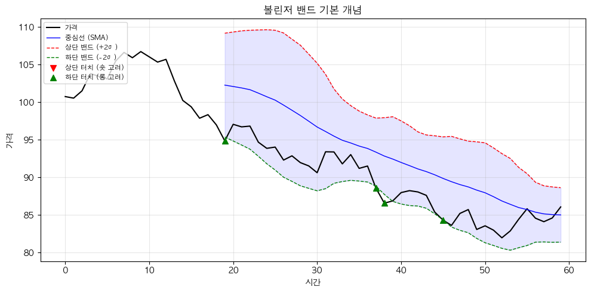
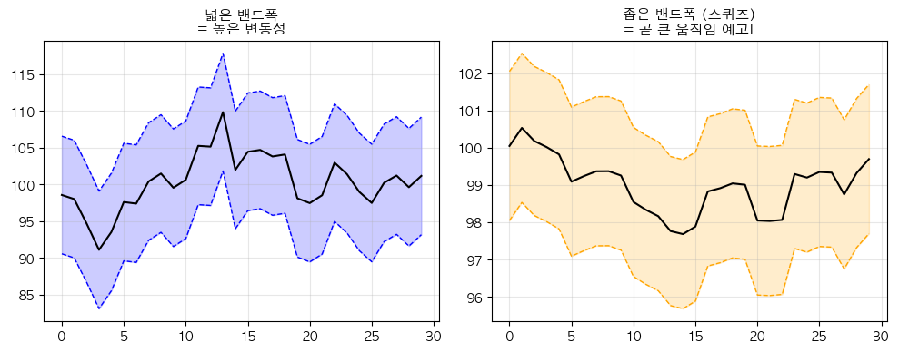

# 해외주식 볼린저 밴드 전략 (Bollinger Bands)

## 전략 ID
`BollingerBands`

## 전략 기여자
ProgramGarden Team

## 간단한 설명

이 전략은 **주가가 평균에서 얼마나 벗어나 있는지를 자동으로 측정해, "지금 이 종목이 과열인지, 침체인지, 변동성 폭발 직전인지"를 간단한 신호로 알려주는 도구**입니다.

볼린저 밴드의 상단/하단 터치, 밴드폭 축소(스퀴즈), 밴드폭 확대(익스팬션) 상태를 자동으로 감지해 **추세 전환 또는 돌파 타이밍을 포착**하는 데 활용할 수 있습니다.

## 📊 볼린저 밴드 시각화

### 1. 기본 구조

가격이 상단 밴드에 닿으면 **과매수 (숏 고려)**, 하단 밴드에 닿으면 **과매도 (롱 고려)**입니다.



### 2. 스퀴즈 패턴

밴드폭이 좁아지면 곧 큰 움직임이 예상됩니다!



## 이 전략이 필요한 이유

- 주가는 항상 **평균을 중심으로 위아래로 흔들리는 특성**이 있습니다.
- 하지만 "지금 가격이 평균 대비 너무 높은지, 낮은지"를 사람이 매번 계산하기는 어렵습니다.
- `BollingerBands` 전략은 복잡한 통계 계산을 숨기고,
    - 현재 가격이 밴드의 어느 위치에 있는지 (Percent B)
    - 밴드폭이 좁아져서 곧 큰 움직임이 나올 것 같은지 (스퀴즈)
    - 밴드폭이 급격히 넓어지고 있는지 (익스팬션)
    등을 한눈에 보여줘 **매매 타이밍 판단 부담을 크게 줄여 줍니다.**

## 전략 상세 설명

### 먼저, 용어를 간단히 정리해 볼게요

- **이동평균선 (SMA, Simple Moving Average)**
    - 최근 N일 동안의 종가를 모두 더한 뒤 N으로 나눈 값입니다.
    - 쉽게 말해 **"최근 N일간의 평균 가격"**이라고 생각하면 됩니다.
    - 볼린저 밴드에서는 이 평균선이 **중심선(Middle Band)** 역할을 합니다.

- **표준편차 (Standard Deviation)**
    - "가격들이 평균에서 얼마나 떨어져 있는가"를 숫자로 나타낸 것입니다.
    - 표준편차가 크면 **가격이 평균에서 많이 벗어나 있다 = 변동성이 크다**는 뜻입니다.
    - 표준편차가 작으면 **가격이 평균 근처에 모여 있다 = 변동성이 작다**는 뜻입니다.

- **상단 밴드 (Upper Band)**
    - 중심선(이동평균) + (표준편차 × 배수)로 계산합니다.
    - 기본 설정에서는 **평균 + 2배 표준편차** 위치에 그려집니다.
    - 가격이 이 선에 닿으면 **"평균보다 상당히 높은 가격"**이라는 의미입니다.

- **하단 밴드 (Lower Band)**
    - 중심선(이동평균) - (표준편차 × 배수)로 계산합니다.
    - 기본 설정에서는 **평균 - 2배 표준편차** 위치에 그려집니다.
    - 가격이 이 선에 닿으면 **"평균보다 상당히 낮은 가격"**이라는 의미입니다.

- **밴드폭 (Bandwidth)**
    - (상단 밴드 - 하단 밴드) ÷ 중심선으로 계산합니다.
    - 이 값이 작으면 **밴드가 좁다 = 변동성이 낮다 = 조만간 큰 움직임이 나올 수 있다**고 해석합니다.

- **Percent B (%B)**
    - 현재 가격이 하단 밴드와 상단 밴드 사이 어디에 위치하는지를 0~1 사이 숫자로 표현합니다.
    - %B가 1 이상이면 상단 밴드 위, 0 이하면 하단 밴드 아래입니다.

- **스퀴즈 (Squeeze)**
    - 밴드폭이 매우 좁아진 상태를 말합니다.
    - **"에너지가 압축되어 있어서 곧 폭발할 준비가 된 상태"**로 비유할 수 있습니다.

- **익스팬션 (Expansion)**
    - 밴드폭이 급격히 넓어지는 상태를 말합니다.
    - **"이미 큰 움직임이 시작되었다"**는 신호로 해석합니다.

### 어떤 방식으로 동작하나요?

1. **데이터 수집**
    - LS증권 OpenAPI를 통해 최근 일봉/주봉/월봉 데이터를 가져옵니다.
    - 설정한 기간(`period`, 기본 20일)만큼의 데이터로 이동평균과 표준편차를 계산합니다.

2. **볼린저 밴드 계산**
    - 중심선 = 최근 N일 종가의 평균
    - 상단 밴드 = 중심선 + (표준편차 × `std_dev`)
    - 하단 밴드 = 중심선 - (표준편차 × `std_dev`)
    - 밴드폭 = (상단 - 하단) ÷ 중심선
    - %B = (현재가 - 하단) ÷ (상단 - 하단)

3. **신호 판단**
    - **상단 터치 (upper_touch)**: 종가가 상단 밴드 이상 → 과열 가능성
    - **하단 터치 (lower_touch)**: 종가가 하단 밴드 이하 → 침체/반등 가능성
    - **스퀴즈 (squeeze)**: 밴드폭이 임계값(`squeeze_threshold`) 이하 → 변동성 폭발 대기
    - **익스팬션 (expansion)**: 밴드폭이 이전 대비 1.5배 이상 확대 → 추세 진행 중

4. **결과 요약**
    - 현재 신호 상태, 밴드 위치, %B 값 등을 정리해서 반환합니다.

### 방향성은 이렇게 해석하세요

- **매수 고려 (하단 터치)**
    - 가격이 하단 밴드에 닿았다는 것은 **"평균보다 상당히 낮은 가격"**이라는 뜻입니다.
    - 이 상태가 오래 지속되기 어렵다고 보고, **반등을 기대하는 매수 신호**로 해석할 수 있습니다.
    - 단, 하락 추세가 강할 때는 밴드를 계속 타고 내려갈 수 있으니 주의가 필요합니다.

- **매도 고려 (상단 터치)**
    - 가격이 상단 밴드에 닿았다는 것은 **"평균보다 상당히 높은 가격"**이라는 뜻입니다.
    - 이 상태가 오래 지속되기 어렵다고 보고, **차익 실현 또는 매도 신호**로 해석할 수 있습니다.
    - 단, 상승 추세가 강할 때는 밴드를 계속 타고 올라갈 수 있으니 주의가 필요합니다.

- **돌파 대기 (스퀴즈)**
    - 밴드폭이 좁아졌다는 것은 **"변동성이 낮아서 곧 큰 움직임이 나올 수 있다"**는 뜻입니다.
    - 이때는 방향을 예측하기보다 **돌파 방향을 확인한 후 따라가는 전략**이 유효합니다.

### 활용 시나리오

- 해외주식을 보유 중인데, **"지금 가격이 너무 높은 건지, 아직 괜찮은 건지"** 객관적으로 판단하고 싶을 때
- 특정 종목이 오랫동안 횡보하고 있어서, **"언제 큰 움직임이 나올지"** 타이밍을 잡고 싶을 때
- 여러 종목을 한꺼번에 스캔해서, **밴드 하단에 닿은 저평가 후보군**을 찾고 싶을 때

## DSL 예시

```python
{
    "condition_id": "BollingerBands",
    "params": {
        "appkey": "발급받은 LS증권 키",
        "appsecretkey": "발급받은 LS증권 시크릿",
        "period": 20,
        "std_dev": 2.0,
        "squeeze_threshold": 0.03,
        "timeframe": "days",
        "qrycnt": 200
    }
}
```

## 파라미터 설명

| 이름 | 타입 | 기본값 | 설명 |
| --- | --- | --- | --- |
| `appkey` | str | - | LS증권에서 발급받은 Open API 키입니다. |
| `appsecretkey` | str | - | LS증권에서 발급받은 Open API 시크릿입니다. |
| `period` | int | 20 | 이동평균을 계산할 기간입니다. 20일이 가장 일반적으로 사용됩니다. 짧게 설정하면 민감해지고, 길게 설정하면 부드러워집니다. |
| `std_dev` | float | 2.0 | 상/하단 밴드를 중심선에서 몇 표준편차 떨어뜨릴지 설정합니다. 2.0이 표준이며, 크게 설정하면 밴드가 넓어져 신호가 드물어집니다. |
| `squeeze_threshold` | float | 0.03 | 밴드폭이 이 값 이하면 "스퀴즈 상태"로 판단합니다. 종목 특성에 따라 조절이 필요합니다. |
| `timeframe` | str | "days" | 캔들 주기입니다. `"days"`(일봉), `"weeks"`(주봉), `"months"`(월봉) 중 선택합니다. |
| `qrycnt` | int | 200 | 불러올 캔들 개수입니다. 계산에 필요한 최소 기간보다 여유있게 설정하세요. |

## 응답 데이터 설명

| 필드 | 설명 |
| --- | --- |
| `last_signal` | 현재 감지된 신호입니다. `"upper_touch"`, `"lower_touch"`, `"squeeze"`, `"expansion"`, `"neutral"` 중 하나입니다. |
| `current.middle` | 현재 중심선(이동평균) 값입니다. |
| `current.upper` | 현재 상단 밴드 값입니다. |
| `current.lower` | 현재 하단 밴드 값입니다. |
| `current.bandwidth` | 현재 밴드폭입니다. 낮을수록 변동성이 축소된 상태입니다. |
| `current.percent_b` | 현재 %B 값입니다. 0~1 사이가 정상이며, 1 초과는 상단 돌파, 0 미만은 하단 돌파를 의미합니다. |
| `snapshots` | 최근 100개 캔들의 밴드 계산 히스토리입니다. |

## 신호 해석 가이드

| 신호 | 의미 | 일반적인 대응 |
| --- | --- | --- |
| `upper_touch` | 상단 밴드 터치 (과매수 가능성) | 차익 실현 고려, 단 강한 상승 추세에서는 밴드를 타고 계속 올라갈 수 있음 |
| `lower_touch` | 하단 밴드 터치 (과매도 가능성) | 반등 매수 고려, 단 강한 하락 추세에서는 밴드를 타고 계속 내려갈 수 있음 |
| `squeeze` | 밴드폭 축소 (횡보 압축) | 방향은 모르지만 곧 큰 움직임 예상, 돌파 방향 확인 후 진입 |
| `expansion` | 밴드폭 확장 (변동성 증가) | 추세가 시작됨, 추세 방향 따라가기 |
| `neutral` | 특별한 신호 없음 | 관망, 다른 지표 참고 |

## 전략 사용 시 주의사항

- 볼린저 밴드는 **"가격이 평균으로 회귀할 것"**이라는 가정에 기반하지만, 강한 추세장에서는 밴드를 타고 계속 움직일 수 있습니다.
- 상단/하단 터치 신호만으로 매수/매도를 결정하기보다는, **다른 지표(RSI, MACD 등)와 함께** 확인하는 것이 좋습니다.
- 스퀴즈 상태에서는 **방향을 예측하기 어려우므로**, 돌파 확인 후 진입하는 것이 안전합니다.
- `squeeze_threshold` 값은 종목마다 다르게 설정해야 할 수 있습니다. 변동성이 원래 낮은 종목은 더 낮은 값을 사용하세요.
- API 인증 정보(`appkey`, `appsecretkey`)는 반드시 안전하게 보관하고, 외부에 노출되지 않도록 주의하세요.
