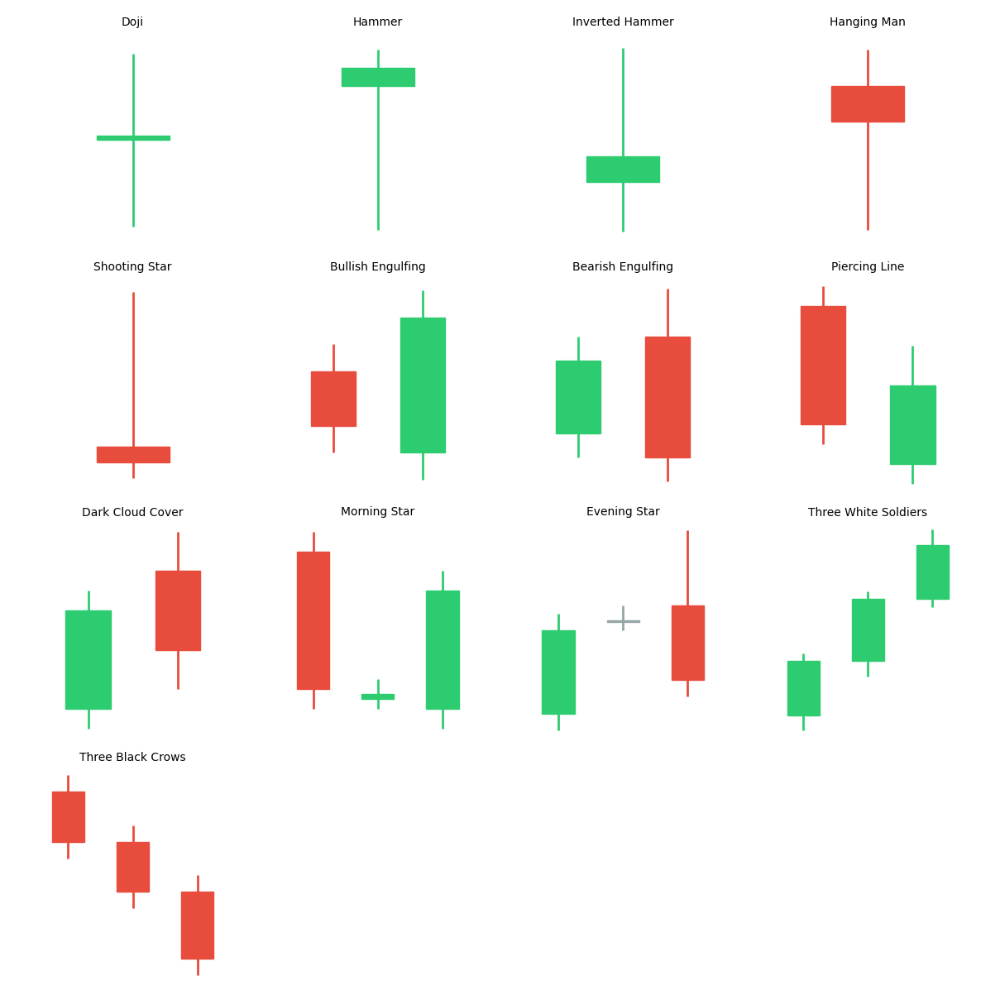

# 해외주식 캔들 패턴 인식 전략 (Candle Patterns)

## 전략 ID
`CandlePatterns`

## 전략 기여자
ProgramGarden Team

## 간단한 설명

이 전략은 **"캔들 모양만 보고 추세 전환을 예측하는"** 클래식한 기술적 분석 기반 전략 조건입니다. 주요 캔들 패턴을 자동 인식하여 강세/약세 신호를 반환합니다.

수백 년간 일본 쌀 거래에서 발전한 캔들 차트 분석법을 자동화했습니다. 특정 모양의 캔들이 나타나면 **"반등할 확률이 높다"** 또는 **"하락할 확률이 높다"**는 신호를 줍니다.

## 캔들스틱 패턴 참고 이미지

각 패턴의 모양과 의미를 한눈에 파악할 수 있습니다.



## 이 전략이 필요한 이유

- 숫자로 된 지표만 보면 **"지금 분위기가 어떤지"** 감이 안 옵니다.
- 캔들 패턴은 **시장 참여자들의 심리**를 직관적으로 보여줍니다.
- 예: "망치형(Hammer)"이 바닥에서 나오면 "한번 밀렸다가 다시 올린 것" = 매수세 유입
- 다른 지표와 함께 쓰면 **매매 타이밍을 더 정확하게** 잡을 수 있습니다.

## 전략 상세 설명

### 먼저, 용어를 간단히 정리해 볼게요

- **캔들 (Candle)**
    - 일정 기간 동안의 시가, 고가, 저가, 종가를 한눈에 보여주는 차트입니다.
    - **양봉**: 종가 > 시가 (상승, 보통 빨간색 또는 초록색)
    - **음봉**: 종가 < 시가 (하락, 보통 파란색 또는 빨간색)

- **몸통 (Body)**
    - 시가와 종가 사이 영역입니다.
    - 몸통이 크면 "그 방향으로 강하게 움직였다"

- **꼬리 (Shadow/Wick)**
    - 고가/저가와 몸통 사이 영역입니다.
    - **윗꼬리**: 한때 더 올라갔다가 내려왔다
    - **아랫꼬리**: 한때 더 내려갔다가 올라왔다

### 지원하는 패턴 목록

#### 단일 캔들 패턴 (1개 캔들)

| 패턴 | 모양 | 신호 | 의미 |
| --- | --- | --- | --- |
| **도지 (DOJI)** | 몸통이 거의 없음 | 중립 | 시가 ≈ 종가, **추세 전환 가능성** |
| **망치형 (HAMMER)** | 긴 아랫꼬리 + 작은 몸통 | 강세 | 바닥에서 나오면 **반등 신호** |
| **역망치형 (INVERTED_HAMMER)** | 긴 윗꼬리 + 작은 몸통 | 강세 | 바닥에서 나오면 **반등 시도** |
| **유성형 (SHOOTING_STAR)** | 긴 윗꼬리 + 작은 몸통 | 약세 | 천장에서 나오면 **하락 신호** |
| **교수형 (HANGING_MAN)** | 긴 아랫꼬리 + 작은 몸통 | 약세 | 천장에서 나오면 **하락 경고** |

#### 2캔들 패턴 (2개 캔들)

| 패턴 | 모양 | 신호 | 의미 |
| --- | --- | --- | --- |
| **상승 장악형 (BULLISH_ENGULFING)** | 음봉 → 큰 양봉이 감싸기 | **강한 강세** | 매도세를 매수세가 압도 |
| **하락 장악형 (BEARISH_ENGULFING)** | 양봉 → 큰 음봉이 감싸기 | **강한 약세** | 매수세를 매도세가 압도 |
| **관통형 (PIERCING)** | 음봉 → 양봉이 중간 이상 회복 | 강세 | 하락 후 강한 회복 |
| **먹구름형 (DARK_CLOUD_COVER)** | 양봉 → 음봉이 중간 이상 하락 | 약세 | 상승 후 강한 하락 |

#### 3캔들 패턴 (3개 캔들)

| 패턴 | 모양 | 신호 | 의미 |
| --- | --- | --- | --- |
| **샛별형 (MORNING_STAR)** | 음봉 → 작은 캔들 → 양봉 | **강한 강세** | 바닥 반전 신호 |
| **석별형 (EVENING_STAR)** | 양봉 → 작은 캔들 → 음봉 | **강한 약세** | 천장 반전 신호 |
| **적삼병 (THREE_WHITE_SOLDIERS)** | 양봉 3개 연속 | 강세 | 강한 상승 추세 시작 |
| **흑삼병 (THREE_BLACK_CROWS)** | 음봉 3개 연속 | 약세 | 강한 하락 추세 시작 |

### 각 패턴 상세 설명

#### 망치형 (Hammer) - 강세 🔨
```
    |
    |       ← 작은 윗꼬리 (거의 없음)
   ===      ← 작은 몸통 (위쪽)
    |
    |
    |       ← 긴 아랫꼬리 (몸통의 2배 이상)
```
- **의미**: "한번 크게 밀렸다가 다시 끌어올렸다"
- **해석**: 매도세가 밀었지만 매수세가 이김 → 바닥에서 나오면 반등 기대
- **주의**: 반드시 **하락 후 바닥 부근**에서 나와야 의미 있음

#### 유성형 (Shooting Star) - 약세 ⭐
```
    |
    |
    |       ← 긴 윗꼬리 (몸통의 2배 이상)
   ===      ← 작은 몸통 (아래쪽)
    |       ← 작은 아랫꼬리 (거의 없음)
```
- **의미**: "한번 크게 올라갔다가 다시 밀렸다"
- **해석**: 매수세가 밀었지만 매도세가 이김 → 천장에서 나오면 하락 기대
- **주의**: 반드시 **상승 후 고점 부근**에서 나와야 의미 있음

#### 장악형 (Engulfing) - 강력한 반전!
```
상승 장악형:                     하락 장악형:
   ===     ← 첫째: 음봉              ===     ← 첫째: 양봉
  =====    ← 둘째: 큰 양봉          =====    ← 둘째: 큰 음봉
           (첫째를 완전히 감쌈)              (첫째를 완전히 감쌈)
```
- **의미**: 이전 캔들을 완전히 뒤집었다
- **해석**: 힘의 균형이 확실히 바뀜 → 가장 신뢰도 높은 반전 신호 중 하나

### 활용 시나리오

- 지지선/저항선 근처에서 **반전 패턴**이 나오는지 확인하고 싶을 때
- 이동평균이나 RSI 신호와 **캔들 패턴을 함께** 확인하고 싶을 때
- 여러 종목을 스캔해서 **반전 패턴이 나온 종목**을 찾고 싶을 때

## DSL 예시

```python
{
    "condition_id": "CandlePatterns",
    "params": {
        "appkey": "발급받은 LS증권 키",
        "appsecretkey": "발급받은 LS증권 시크릿",
        "body_threshold": 0.001,
        "shadow_ratio": 2.0,
        "engulfing_margin": 1.01,
        "timeframe": "days",
        "qrycnt": 200
    }
}
```

## 파라미터 설명

| 이름 | 타입 | 기본값 | 설명 |
| --- | --- | --- | --- |
| `appkey` | str | - | LS증권에서 발급받은 Open API 키입니다. |
| `appsecretkey` | str | - | LS증권에서 발급받은 Open API 시크릿입니다. |
| `body_threshold` | float | 0.001 | 도지 판단 기준입니다. 몸통이 가격의 이 비율 이하면 도지로 판단합니다 (0.1%). |
| `shadow_ratio` | float | 2.0 | 망치형/유성형에서 꼬리가 몸통의 몇 배 이상이어야 하는지 설정합니다. |
| `engulfing_margin` | float | 1.01 | 장악형에서 두 번째 캔들이 첫 번째보다 몇 배 이상 커야 하는지 설정합니다 (1.01 = 1% 이상). |
| `timeframe` | str | "days" | 캔들 주기입니다. `"days"`, `"weeks"`, `"months"` 중 선택 |
| `qrycnt` | int | 200 | 불러올 캔들 개수입니다. |

## 응답 데이터 설명

| 필드 | 설명 |
| --- | --- |
| `patterns` | 감지된 패턴 목록입니다. |
| `patterns[].name` | 패턴 이름입니다 (예: "HAMMER", "BULLISH_ENGULFING"). |
| `patterns[].signal` | 신호 유형입니다. `"bullish"`, `"bearish"`, `"neutral"` |
| `patterns[].strength` | 신호 강도입니다. `"strong"`, `"moderate"`, `"weak"` |
| `latest_signal` | 가장 최근 감지된 신호입니다. |
| `bullish_count` | 강세 패턴 개수입니다. |
| `bearish_count` | 약세 패턴 개수입니다. |

## 신호 해석 가이드

### 강세 패턴 (매수 고려)
| 패턴 | 강도 | 조건 |
| --- | --- | --- |
| `BULLISH_ENGULFING` | 강함 | 바닥에서 출현 시 |
| `MORNING_STAR` | 강함 | 바닥에서 출현 시 |
| `THREE_WHITE_SOLDIERS` | 강함 | 상승 시작 |
| `HAMMER` | 중간 | 바닥에서 출현 시 |
| `PIERCING` | 중간 | 바닥에서 출현 시 |

### 약세 패턴 (매도 고려)
| 패턴 | 강도 | 조건 |
| --- | --- | --- |
| `BEARISH_ENGULFING` | 강함 | 천장에서 출현 시 |
| `EVENING_STAR` | 강함 | 천장에서 출현 시 |
| `THREE_BLACK_CROWS` | 강함 | 하락 시작 |
| `SHOOTING_STAR` | 중간 | 천장에서 출현 시 |
| `DARK_CLOUD_COVER` | 중간 | 천장에서 출현 시 |

## 캔들 패턴 활용 팁

### 1. 위치가 중요합니다!
같은 패턴이라도 **어디서 나오느냐**에 따라 의미가 달라집니다.
- 망치형은 **바닥에서** 나와야 의미 있음 (고점에서 나오면 교수형!)
- 유성형은 **천장에서** 나와야 의미 있음

### 2. 지지/저항선과 함께 보세요
- 지지선에서 강세 패턴 → 신뢰도 ↑
- 저항선에서 약세 패턴 → 신뢰도 ↑

### 3. 거래량을 확인하세요
- 패턴 발생 시 거래량이 평소보다 많으면 신뢰도 ↑
- 거래량 없이 나온 패턴은 신뢰도 ↓

### 4. 다른 지표와 조합하세요
- RSI 과매도 + 망치형 → 강력한 매수 신호
- RSI 과매수 + 유성형 → 강력한 매도 신호

## 전략 사용 시 주의사항

- **캔들 패턴 단독으로는 승률이 낮습니다**. 반드시 다른 분석과 함께 사용하세요.
- 같은 패턴이라도 **맥락(추세, 위치, 거래량)에 따라** 의미가 달라집니다.
- 시간 프레임이 길수록 (일봉 > 시간봉 > 분봉) 신뢰도가 높습니다.
- 횡보장에서는 패턴 신뢰도가 떨어집니다. **추세가 있는 상황**에서 더 유효합니다.
- 파라미터(`body_threshold`, `shadow_ratio`)를 너무 느슨하게 설정하면 거짓 신호가 많아집니다.
