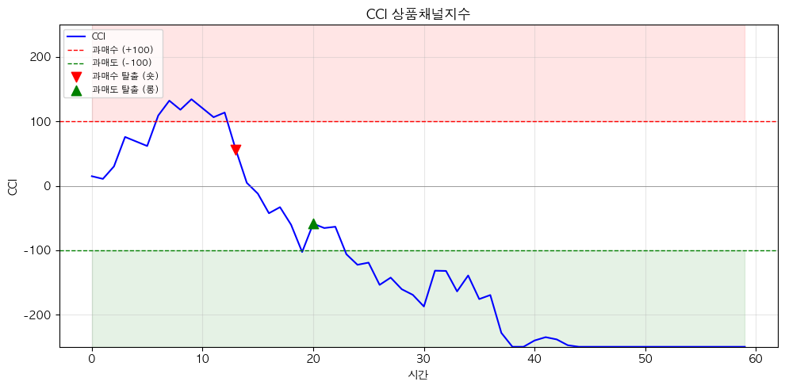

# 해외주식 CCI 상품채널지수 전략 (Commodity Channel Index)

## 전략 ID
`CCI`

## 전략 기여자
ProgramGarden Team

## 간단한 설명

이 전략은 **"현재 가격이 평균에서 얼마나 벗어났는지"를 숫자로 알려주는 도구**입니다.

CCI가 +100 이상이면 **"평균보다 비정상적으로 높다 (과매수)"**, -100 이하면 **"평균보다 비정상적으로 낮다 (과매도)"**라고 해석합니다. 원래 원자재(Commodity) 시장용으로 개발되었지만, 주식에도 널리 사용됩니다.

## 📊 CCI 시각화

### CCI 신호 패턴

CCI가 -100 이하에서 상승하면 **롱**, +100 이상에서 하락하면 **숏** 신호입니다.



## 이 전략이 필요한 이유

- 가격이 올랐을 때 **"더 오를지, 이제 떨어질지"** 판단이 어렵습니다.
- CCI는 **"가격이 평균 대비 얼마나 극단적인 위치에 있는지"**를 객관적으로 보여줍니다.
- 과매수 구간에서는 매도를, 과매도 구간에서는 매수를 고려할 수 있습니다.
- 또한 **새로운 추세의 시작**을 포착하는 데도 활용됩니다.

## 전략 상세 설명

### 먼저, 용어를 간단히 정리해 볼게요

- **전형가 (Typical Price)**
    - (고가 + 저가 + 종가) ÷ 3 으로 계산합니다.
    - 그날 가격의 **대표값**이라고 생각하면 됩니다.
    - 종가만 보는 것보다 하루 전체의 가격 움직임을 반영합니다.

- **이동평균 (SMA)**
    - 최근 N일간 전형가의 평균입니다.
    - **"최근 가격들의 중심"**이라고 생각하면 됩니다.

- **평균편차 (Mean Deviation)**
    - 전형가들이 평균에서 얼마나 떨어져 있는지의 평균입니다.
    - **"가격들이 평균에서 보통 얼마나 벗어나는가"**를 나타냅니다.
    - 표준편차와 비슷한 개념이지만, 계산이 더 단순합니다.

- **CCI 값**
    - (현재 전형가 - 평균) ÷ (0.015 × 평균편차)로 계산합니다.
    - 0.015는 대부분의 CCI 값이 -100~+100 사이에 오도록 하는 상수입니다.
    - **CCI가 0이면**: 현재 가격이 평균과 같다
    - **CCI가 +100이면**: 평균보다 상당히 높다 (과매수)
    - **CCI가 -100이면**: 평균보다 상당히 낮다 (과매도)

### CCI 숫자 해석하기

| CCI 값 | 상태 | 의미 |
| --- | --- | --- |
| **+100 이상** | 과매수 | 가격이 평균보다 비정상적으로 높음. 하락 가능성. |
| **0 ~ +100** | 정상 (상승 쪽) | 평균보다 높지만 정상 범위 |
| **-100 ~ 0** | 정상 (하락 쪽) | 평균보다 낮지만 정상 범위 |
| **-100 이하** | 과매도 | 가격이 평균보다 비정상적으로 낮음. 반등 가능성. |

### 어떤 방식으로 동작하나요?

1. **데이터 수집**
    - LS증권 OpenAPI에서 가격 데이터를 가져옵니다.

2. **전형가 계산**
    - 각 캔들의 (고가 + 저가 + 종가) ÷ 3을 계산합니다.

3. **CCI 계산**
    - 전형가의 이동평균을 구합니다.
    - 평균편차를 계산합니다.
    - CCI = (현재 전형가 - 이동평균) ÷ (0.015 × 평균편차)

4. **신호 판단**
    - CCI > +100: **과매수 (overbought)**
    - CCI < -100: **과매도 (oversold)**
    - 0선 돌파: **추세 전환 신호**

### 방향성은 이렇게 해석하세요

- **역추세 매매 (Mean Reversion)**
    - CCI가 +100 이상에서 다시 내려오면 → 매도 고려
    - CCI가 -100 이하에서 다시 올라오면 → 매수 고려
    - "극단적인 상태는 오래가지 않는다"는 논리입니다.

- **추세 추종 매매 (Trend Following)**
    - CCI가 0선을 위로 돌파하면 → 상승 추세 시작, 매수
    - CCI가 0선을 아래로 돌파하면 → 하락 추세 시작, 매도
    - "0을 넘어서면 추세가 바뀌었다"는 논리입니다.

- **다이버전스 (Divergence)**
    - 가격은 신고가인데 CCI는 전고점보다 낮다 → **하락 전환 경고**
    - 가격은 신저가인데 CCI는 전저점보다 높다 → **상승 전환 기대**

### 활용 시나리오

- 급등한 종목이 **"아직 더 오를지, 이제 팔아야 할지"** 판단할 때 → CCI가 +100 이상이고 꺾이기 시작하면 주의
- 급락한 종목이 **"바닥인지, 더 떨어질지"** 판단할 때 → CCI가 -100 이하에서 반등 시 매수 고려
- 횡보하던 종목이 **새로운 추세를 시작하는지** 확인할 때 → CCI가 0선을 돌파하는지 체크

## DSL 예시

```python
{
    "condition_id": "CCI",
    "params": {
        "appkey": "발급받은 LS증권 키",
        "appsecretkey": "발급받은 LS증권 시크릿",
        "period": 20,
        "overbought": 100,
        "oversold": -100,
        "timeframe": "days",
        "qrycnt": 200
    }
}
```

## 파라미터 설명

| 이름 | 타입 | 기본값 | 설명 |
| --- | --- | --- | --- |
| `appkey` | str | - | LS증권에서 발급받은 Open API 키입니다. |
| `appsecretkey` | str | - | LS증권에서 발급받은 Open API 시크릿입니다. |
| `period` | int | 20 | CCI 계산 기간입니다. 20일이 표준이며, 짧게 하면 민감해집니다. |
| `overbought` | int | 100 | 이 값 이상이면 "과매수"로 판단합니다. |
| `oversold` | int | -100 | 이 값 이하면 "과매도"로 판단합니다. |
| `timeframe` | str | "days" | 캔들 주기입니다. `"days"`, `"weeks"`, `"months"` 중 선택 |
| `qrycnt` | int | 200 | 불러올 캔들 개수입니다. |

## 응답 데이터 설명

| 필드 | 설명 |
| --- | --- |
| `signal` | 현재 신호입니다. `"overbought"`, `"oversold"`, `"bullish"`, `"bearish"`, `"neutral"` |
| `cci` | 현재 CCI 값입니다. |
| `typical_price` | 현재 전형가입니다. |
| `sma` | 전형가의 이동평균입니다. |
| `zero_cross` | 0선 돌파 여부입니다. `"bullish_cross"` (상향), `"bearish_cross"` (하향), `"none"` |
| `extreme_level` | 극단 수준입니다. `"extremely_overbought"` (200 이상), `"extremely_oversold"` (-200 이하), `"none"` |

## 신호 해석 가이드

| 신호 | 의미 | 일반적인 대응 |
| --- | --- | --- |
| `overbought` | CCI > +100 (과매수) | 매도 또는 이익 실현 고려. 단, 강한 상승장에서는 계속 과매수 유지 가능 |
| `oversold` | CCI < -100 (과매도) | 매수 고려. 단, 강한 하락장에서는 계속 과매도 유지 가능 |
| `bullish` | CCI가 0선 위 (상승 쪽) | 상승 추세가 우세함 |
| `bearish` | CCI가 0선 아래 (하락 쪽) | 하락 추세가 우세함 |
| `neutral` | 특별한 신호 없음 | 관망 |

## CCI 활용 전략

### 1. 역추세 매매 (기본)
- CCI가 +100 이상에서 다시 +100 아래로 떨어지면 **매도**
- CCI가 -100 이하에서 다시 -100 위로 올라오면 **매수**

### 2. 0선 돌파 매매
- CCI가 0을 위로 돌파하면 **매수**
- CCI가 0을 아래로 돌파하면 **매도**

### 3. 다이버전스 매매
- 가격 신고가 + CCI 고점 하락 → **약세 다이버전스** (매도 준비)
- 가격 신저가 + CCI 저점 상승 → **강세 다이버전스** (매수 준비)

## 전략 사용 시 주의사항

- CCI가 +100을 넘었다고 **바로 매도하면 안 됩니다**. 강한 추세에서는 +200, +300까지도 갈 수 있습니다.
- 과매수/과매도 신호는 **"주의"** 신호이지 **"즉시 행동"** 신호가 아닙니다.
- CCI가 극단 영역에서 **다시 돌아오는 것을 확인**한 후 행동하는 것이 안전합니다.
- 다른 지표(이동평균, RSI, MACD 등)와 함께 사용하면 신뢰도가 높아집니다.
- `period`를 너무 짧게 설정하면 노이즈가 많아집니다. 20일이 적당합니다.
