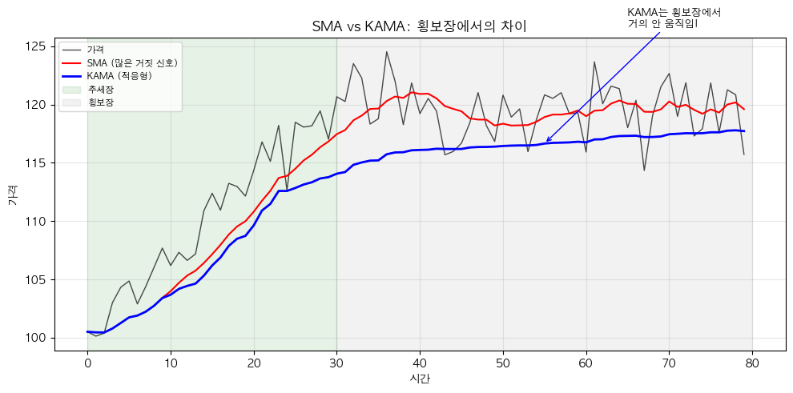

# 해외주식 KAMA 적응 이동평균 전략 (Kaufman's Adaptive Moving Average)

## 전략 ID
`KAMA`

## 전략 기여자
ProgramGarden Team

## 간단한 설명

이 전략은 **"시장 상황에 따라 스스로 속도를 조절하는 똑똑한 이동평균선"**입니다.

추세가 강할 때는 빠르게 반응하고, 횡보할 때는 느리게 움직여서 **거짓 신호를 줄여줍니다**. 일반 이동평균의 약점(느리거나 노이즈에 민감함)을 보완한 고급 기술적 지표입니다.

## 📊 KAMA 시각화

### SMA vs KAMA 비교

KAMA는 추세장에서 빠르게 반응하고, 횡보장에서 거의 움직이지 않아 거짓 신호를 줄입니다.



## 이 전략이 필요한 이유

- **단순 이동평균(SMA)**은 추세 변화에 반응이 너무 느립니다.
- **지수 이동평균(EMA)**은 빠르지만 **가격 노이즈에도 민감하게 반응**해서 거짓 신호가 많습니다.
- KAMA는 **"지금 추세가 강한가, 약한가"를 스스로 판단**해서:
    - 강한 추세 → EMA처럼 빠르게 반응
    - 횡보장 → 거의 움직이지 않음 (거짓 신호 방지)

## 전략 상세 설명

### 먼저, 용어를 간단히 정리해 볼게요

- **이동평균선 (Moving Average)**
    - 최근 N일간의 가격을 평균 낸 선입니다.
    - 가격의 흐름을 부드럽게 보여주는 역할을 합니다.
    - 하지만 단점이 있죠: SMA는 느리고, EMA는 노이즈에 민감합니다.

- **효율비 (Efficiency Ratio, ER)**
    - **"가격이 얼마나 효율적으로 움직였는가"**를 측정합니다.
    - 계산법: (방향성 있는 움직임) ÷ (총 움직임)
    - **ER이 1에 가까우면**: 한 방향으로 꾸준히 움직임 (강한 추세)
    - **ER이 0에 가까우면**: 왔다갔다 하면서 제자리 (횡보)

- **적응 상수 (Smoothing Constant, SC)**
    - 효율비를 바탕으로 계산되는 값입니다.
    - ER이 높으면 SC가 커져서 **KAMA가 빠르게 반응**합니다.
    - ER이 낮으면 SC가 작아져서 **KAMA가 거의 안 움직입니다**.

- **KAMA 값**
    - 적응 상수를 적용한 이동평균 값입니다.
    - "지금 가격의 적응형 평균"이라고 생각하면 됩니다.

### 어떤 방식으로 동작하나요?

1. **데이터 수집**
    - LS증권 OpenAPI 차트 데이터를 이용해 가격 시계를 불러옵니다.

2. **효율비(ER) 계산**
    - 최근 N일간 가격이 "한 방향으로 얼마나 움직였는지" vs "총 얼마나 움직였는지"를 비교합니다.
    - 추세가 강하면 ER → 1, 횡보하면 ER → 0

3. **적응 상수(SC) 계산**
    - ER을 바탕으로 KAMA가 얼마나 빠르게 반응할지 결정합니다.

4. **KAMA 계산**
    - 전일 KAMA + SC × (현재가 - 전일 KAMA)
    - SC가 크면 빨리 따라가고, SC가 작으면 천천히 따라갑니다.

5. **신호 판단**
    - 가격이 KAMA 위로 올라가면 **상승 신호**
    - 가격이 KAMA 아래로 내려가면 **하락 신호**
    - KAMA 자체가 상승하면 **상승 추세**, 하락하면 **하락 추세**

### 방향성은 이렇게 해석하세요

- **매수 신호 (price_above_kama)**
    - 현재 가격이 KAMA 위에 있습니다.
    - **"추세가 상승 쪽으로 기울어져 있다"**고 해석합니다.

- **매도 신호 (price_below_kama)**
    - 현재 가격이 KAMA 아래에 있습니다.
    - **"추세가 하락 쪽으로 기울어져 있다"**고 해석합니다.

- **추세 강도 확인**
    - KAMA가 가격을 빠르게 따라가면: 추세가 강함
    - KAMA가 거의 안 움직이면: 횡보 중 (매매 자제)

### 활용 시나리오

- 이동평균 전략을 쓰고 싶은데, **횡보장에서 거짓 신호가 너무 많아서** 고민일 때
- 추세가 시작될 때 **빠르게 진입하고 싶지만**, 노이즈에 휘둘리고 싶지 않을 때
- 다른 이동평균과 비교해서 **더 정확한 추세 판단**을 하고 싶을 때

## DSL 예시

```python
{
    "condition_id": "KAMA",
    "params": {
        "appkey": "발급받은 LS증권 키",
        "appsecretkey": "발급받은 LS증권 시크릿",
        "er_period": 10,
        "fast_period": 2,
        "slow_period": 30,
        "signal_threshold": 0.01,
        "timeframe": "days",
        "qrycnt": 200
    }
}
```

## 파라미터 설명

| 이름 | 타입 | 기본값 | 설명 |
| --- | --- | --- | --- |
| `appkey` | str | - | LS증권에서 발급받은 Open API 키입니다. |
| `appsecretkey` | str | - | LS증권에서 발급받은 Open API 시크릿입니다. |
| `er_period` | int | 10 | 효율비(ER)를 계산할 기간입니다. 보통 10일을 사용합니다. |
| `fast_period` | int | 2 | 추세가 강할 때 적용할 빠른 EMA 기간입니다. 작을수록 민감해집니다. |
| `slow_period` | int | 30 | 횡보할 때 적용할 느린 EMA 기간입니다. 클수록 덜 움직입니다. |
| `signal_threshold` | float | 0.01 | KAMA 변화율이 이 값 이상이면 신호로 인식합니다 (1% = 0.01). |
| `timeframe` | str | "days" | 캔들 주기입니다. `"days"`, `"weeks"`, `"months"` 중 선택 |
| `qrycnt` | int | 200 | 불러올 캔들 개수입니다. |

## 응답 데이터 설명

| 필드 | 설명 |
| --- | --- |
| `signal` | 현재 신호입니다. `"bullish"` (매수), `"bearish"` (매도), `"neutral"` (관망) |
| `current_kama` | 현재 KAMA 값입니다. |
| `current_price` | 현재 종가입니다. |
| `efficiency_ratio` | 현재 효율비 값입니다. 1에 가까울수록 추세가 강합니다. |
| `price_vs_kama` | 가격이 KAMA 대비 몇 % 위/아래에 있는지 보여줍니다. |
| `kama_slope` | KAMA의 기울기(변화율)입니다. 양수면 상승 추세, 음수면 하락 추세. |

## 신호 해석 가이드

| 신호 | 조건 | 일반적인 대응 |
| --- | --- | --- |
| `bullish` | 가격 > KAMA 이고 KAMA 상승 중 | 매수 고려 |
| `bearish` | 가격 < KAMA 이고 KAMA 하락 중 | 매도 고려 |
| `neutral` | 효율비가 낮거나 방향이 불명확 | 관망, 횡보장일 가능성 |

## KAMA vs 일반 이동평균 비교

| 특성 | SMA | EMA | KAMA |
| --- | --- | --- | --- |
| 반응 속도 | 느림 | 빠름 | 상황에 따라 자동 조절 |
| 거짓 신호 | 적음 | 많음 | 적음 |
| 추세장 | 느린 진입 | 빠른 진입 | 빠른 진입 |
| 횡보장 | 안정적 | 불안정 | 안정적 |
| 적합한 상황 | 장기 추세 | 단기 추세 | 모든 상황 |

## 전략 사용 시 주의사항

- KAMA는 **"만능"이 아닙니다**. 다른 지표와 함께 사용하면 효과가 더 좋습니다.
- `er_period`를 너무 짧게 설정하면 효율비 계산이 불안정해질 수 있습니다.
- **급등/급락 구간에서는** 일반 EMA보다 반응이 늦을 수 있습니다 (횡보 후 돌파 시).
- 효율비가 낮은 구간(횡보장)에서 발생하는 신호는 신뢰도가 낮습니다.
- 실제 매매 전에 **백테스팅**을 통해 파라미터를 조절해 보세요.
