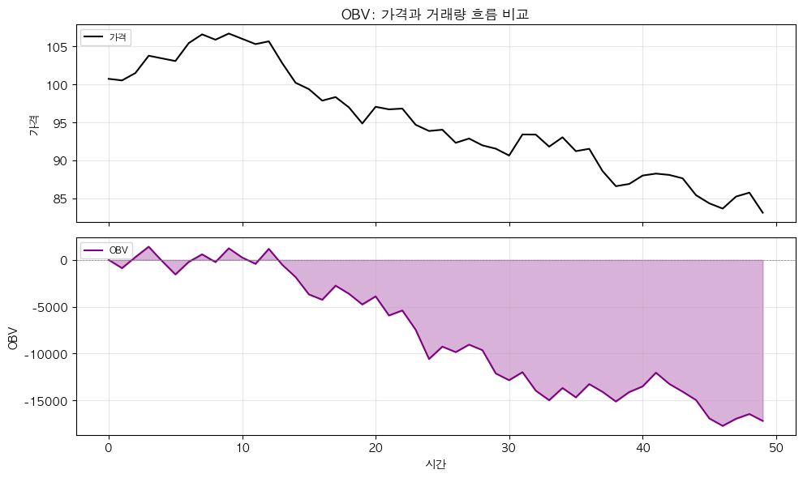
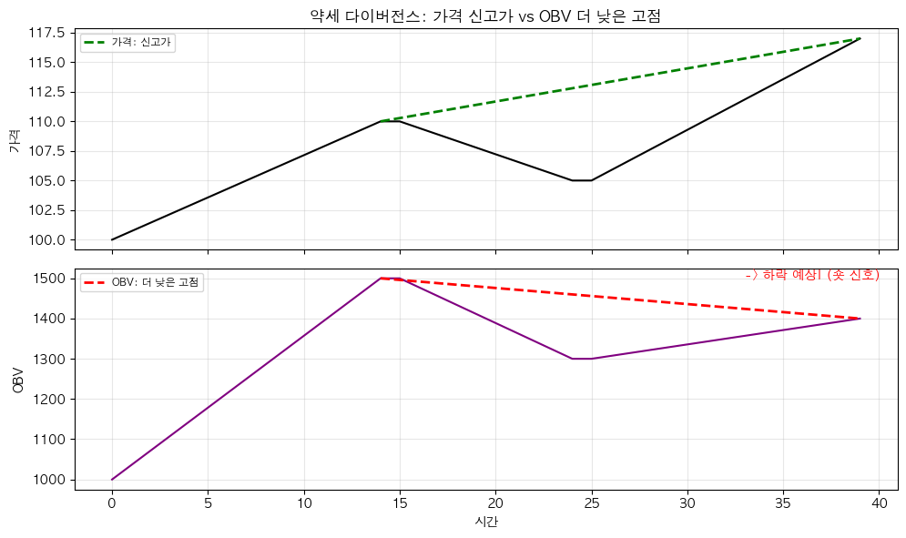

# 해외주식 OBV 거래량 분석 전략 (On Balance Volume)

## 전략 ID
`OBV`

## 전략 기여자
ProgramGarden Team

## 간단한 설명

이 전략은 **"거래량을 보고 큰손들이 사고 있는지 팔고 있는지"를 알려주는 도구**입니다.

OBV는 "거래량이 가격에 선행한다"는 원리에 기반합니다. 쉽게 말해, **가격이 오르기 전에 거래량이 먼저 증가하고, 떨어지기 전에 거래량이 먼저 빠진다**는 것입니다. 이를 통해 "스마트 머니(큰손)"의 움직임을 포착할 수 있습니다.

## 📊 OBV 시각화

### 1. 기본 개념

OBV가 상승하면 **매수 압력 증가**, 하락하면 **매도 압력 증가**입니다.



### 2. 다이버전스 패턴

가격과 OBV가 다르게 움직일 때 추세 전환을 예고합니다.



## 이 전략이 필요한 이유

- 가격만 봐서는 **"진짜 상승인지, 가짜 상승인지"** 구분하기 어렵습니다.
- 큰손들은 **가격이 본격적으로 오르기 전에 미리 매집**합니다.
- OBV가 상승하면 "거래량이 상승일에 몰리고 있다 = 매집 중"
- OBV가 하락하면 "거래량이 하락일에 몰리고 있다 = 분산 중"
- **가격은 오르는데 OBV가 떨어지면?** → 위험 신호! (약세 다이버전스)

## 전략 상세 설명

### 먼저, 용어를 간단히 정리해 볼게요

- **OBV (On Balance Volume)**
    - 거래량을 누적한 값입니다.
    - 가격이 올랐으면 그날 거래량을 **더하고**
    - 가격이 내렸으면 그날 거래량을 **뺍니다**
    - 결과적으로 "상승일 거래량 - 하락일 거래량"의 누적입니다.

- **매집 (Accumulation)**
    - 큰손들이 조용히 주식을 사 모으는 것입니다.
    - OBV가 상승하면 매집 중일 가능성이 높습니다.
    - "아직 가격은 안 올랐지만, 누군가 열심히 사고 있다"

- **분산 (Distribution)**
    - 큰손들이 조용히 주식을 파는 것입니다.
    - OBV가 하락하면 분산 중일 가능성이 높습니다.
    - "가격은 유지되지만, 누군가 열심히 팔고 있다"

- **다이버전스 (Divergence)**
    - 가격과 OBV가 **다른 방향**으로 움직일 때입니다.
    - **강세 다이버전스**: 가격 ↓ + OBV ↑ → 곧 반등 가능
    - **약세 다이버전스**: 가격 ↑ + OBV ↓ → 곧 하락 가능
    - **가장 중요한 신호입니다!**

- **OBV EMA**
    - OBV의 이동평균선입니다.
    - OBV가 EMA 위면 "상승 압력이 우세", 아래면 "하락 압력이 우세"

### 계산 방식 이해하기

```
오늘 종가 > 어제 종가:
    OBV = 전일 OBV + 오늘 거래량

오늘 종가 < 어제 종가:
    OBV = 전일 OBV - 오늘 거래량

오늘 종가 = 어제 종가:
    OBV = 전일 OBV (변화 없음)
```

### 어떤 방식으로 동작하나요?

1. **데이터 수집**
    - LS증권 OpenAPI에서 가격과 거래량 데이터를 가져옵니다.

2. **OBV 계산**
    - 매일 종가 변화에 따라 거래량을 더하거나 뺍니다.

3. **신호 판단**
    - OBV > OBV EMA: **매집 (accumulation)**
    - OBV < OBV EMA: **분산 (distribution)**
    - 가격과 OBV 방향 불일치: **다이버전스 (가장 중요!)**

### 방향성은 이렇게 해석하세요

- **매수 고려 (강세 다이버전스)**
    - 가격은 떨어지는데 OBV는 올라가면
    - "가격은 빠지지만 거래량은 상승일에 몰린다 = 누군가 매집 중"
    - 곧 반등할 가능성이 높습니다!

- **매도 고려 (약세 다이버전스)**
    - 가격은 오르는데 OBV는 떨어지면
    - "가격은 오르지만 거래량은 하락일에 몰린다 = 누군가 분산 중"
    - 곧 하락할 가능성이 높습니다!

- **추세 확인**
    - OBV와 가격이 같이 상승: 건강한 상승 추세
    - OBV와 가격이 같이 하락: 건강한 하락 추세
    - 방향이 다르면 추세 전환 주의!

### 활용 시나리오

- 종목이 횡보할 때, **"조만간 어느 방향으로 터질지"** 예측하고 싶을 때 → OBV 방향 확인
- 상승 중인 종목이 **"진짜 상승인지 가짜인지"** 확인하고 싶을 때 → OBV가 함께 오르는지 확인
- 가격이 저항선을 돌파할 때 **"진짜 돌파인지"** 확인하고 싶을 때 → OBV도 신고점인지 확인

## DSL 예시

```python
{
    "condition_id": "OBV",
    "params": {
        "appkey": "발급받은 LS증권 키",
        "appsecretkey": "발급받은 LS증권 시크릿",
        "ema_period": 20,
        "divergence_lookback": 20,
        "timeframe": "days",
        "qrycnt": 200
    }
}
```

## 파라미터 설명

| 이름 | 타입 | 기본값 | 설명 |
| --- | --- | --- | --- |
| `appkey` | str | - | LS증권에서 발급받은 Open API 키입니다. |
| `appsecretkey` | str | - | LS증권에서 발급받은 Open API 시크릿입니다. |
| `ema_period` | int | 20 | OBV의 EMA 계산 기간입니다. |
| `divergence_lookback` | int | 20 | 다이버전스를 감지할 과거 기간입니다. |
| `timeframe` | str | "days" | 캔들 주기입니다. `"days"`, `"weeks"`, `"months"` 중 선택 |
| `qrycnt` | int | 200 | 불러올 캔들 개수입니다. |

## 응답 데이터 설명

| 필드 | 설명 |
| --- | --- |
| `signal` | 현재 신호입니다. `"accumulation"` (매집), `"distribution"` (분산) |
| `obv` | 현재 OBV 값입니다. |
| `obv_ema` | OBV의 EMA 값입니다. |
| `obv_above_ema` | OBV가 EMA 위에 있는지 여부입니다. |
| `divergence` | 다이버전스 상태입니다. `"bullish"`, `"bearish"`, `"none"` |
| `obv_trend` | OBV의 추세입니다. `"rising"` (상승), `"falling"` (하락) |
| `price_trend` | 가격의 추세입니다. `"rising"` (상승), `"falling"` (하락) |

## 신호 해석 가이드

| 상황 | 해석 | 대응 |
| --- | --- | --- |
| OBV > EMA | 매집 중 (상승 압력) | 보유 또는 매수 고려 |
| OBV < EMA | 분산 중 (하락 압력) | 청산 또는 매도 고려 |
| 가격 ↑ + OBV ↑ | 건강한 상승 추세 | 추세 따라가기 |
| 가격 ↓ + OBV ↓ | 건강한 하락 추세 | 진입 자제, 관망 |
| **가격 ↓ + OBV ↑** | **강세 다이버전스!** | **반등 매수 준비!** |
| **가격 ↑ + OBV ↓** | **약세 다이버전스!** | **하락 대비, 청산 고려!** |

## OBV 활용 실전 예시

### 예시 1: 돌파 확인
- AAPL이 $180 저항선을 돌파
- OBV도 함께 신고점 돌파 → **진짜 돌파! 매수**
- OBV는 제자리 → **가짜 돌파 가능성, 관망**

### 예시 2: 약세 다이버전스 감지
- 주가가 $150 → $160으로 상승 (신고가)
- OBV는 이전 고점보다 낮음
- → **"가격은 오르지만 거래량은 따라오지 않는다"**
- → **하락 가능성 높음, 이익 실현 고려!**

### 예시 3: 매집 감지
- 주가가 횡보 중 ($140~$145)
- OBV가 서서히 상승 중
- → **"누군가 조용히 매집 중"**
- → **곧 상승 돌파 가능, 매수 준비!**

## 전략 사용 시 주의사항

- OBV는 **절대값보다 방향이 중요**합니다. OBV 숫자 자체보다 "올라가는지 내려가는지"를 보세요.
- **다이버전스가 가장 강력한 신호**입니다. 다이버전스 발생 시 주목하세요!
- OBV는 **주식에서 가장 잘 작동**합니다. 선물/옵션보다 주식에 적합합니다.
- 거래량이 매우 적은 종목에서는 OBV 신호가 불안정할 수 있습니다.
- 다른 지표(가격 패턴, 이동평균, RSI 등)와 함께 사용하면 신뢰도가 높아집니다.
