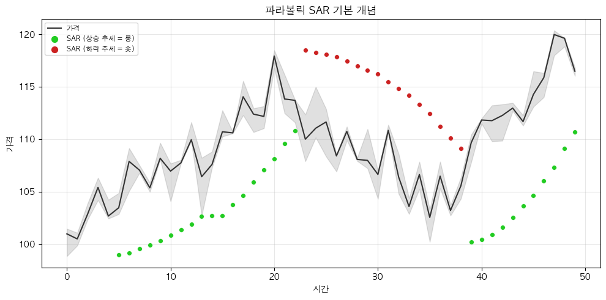
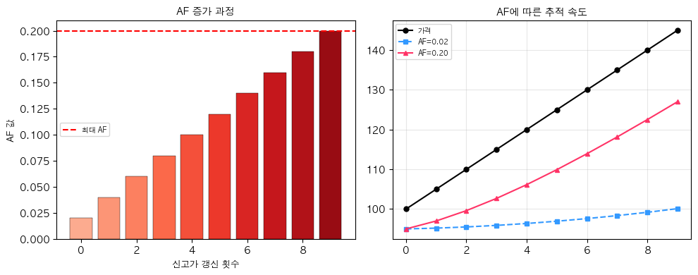

# 해외주식 파라볼릭 SAR 전략 (Parabolic SAR)

## 전략 ID
`ParabolicSAR`

## 전략 기여자
ProgramGarden Team

## 간단한 설명

이 전략은 **"지금이 상승 추세인지 하락 추세인지, 그리고 언제 추세가 바뀌는지"를 자동으로 알려주는 도구**입니다.

차트에서 가격 아래나 위에 점들이 포물선(Parabola) 모양으로 따라붙는데, 이 점의 위치가 바뀌는 순간이 바로 **추세 전환 신호**입니다. SAR은 "Stop And Reverse(멈추고 방향을 바꿔라)"의 약자로, **손절/청산 타이밍과 재진입 시점을 동시에 알려줍니다**.

## 📊 파라볼릭 SAR 시각화

### 1. 기본 개념

SAR 점이 가격 아래에 있으면 **상승 추세(롱)**, 가격 위에 있으면 **하락 추세(숏)**입니다.



### 2. 반전(Reversal) 포인트

SAR 점의 위치가 바뀌는 순간이 **추세 전환 신호**입니다.


### 3. 가속 계수(AF) 작동 원리

추세가 지속될수록 AF가 증가하여 SAR이 가격에 더 빠르게 접근합니다.



### 4. SAR을 트레일링 스탑으로 활용

SAR 값을 손절선으로 사용하면 추세를 따라가면서 이익을 보호할 수 있습니다.


## 이 전략이 필요한 이유

- "지금 추세가 살아있는지, 아닌지"를 판단하기 어렵습니다.
- 이익이 나고 있을 때 **"언제 팔아야 할지"** 타이밍을 잡기 어렵습니다.
- 파라볼릭 SAR은 **자동으로 추세를 따라가면서** 손절선을 올려주기 때문에, 이익을 지키면서 추세를 끝까지 탈 수 있습니다.

## 전략 상세 설명

### 먼저, 용어를 간단히 정리해 볼게요

- **SAR (Stop And Reverse)**
    - 차트에 점으로 표시되는 값입니다.
    - 가격이 이 점을 터치하면 "추세가 끝났으니 멈추고(Stop), 방향을 바꿔라(Reverse)"라는 신호입니다.
    - 쉽게 말해 **"이 점을 넘어가면 추세가 바뀐다"**라고 생각하면 됩니다.

- **상승 추세 (Bullish)**
    - SAR 점이 **가격 아래**에 있을 때입니다.
    - 점이 아래에 있으니까 **"가격이 점 위에 있다 = 상승 중"**이라고 해석합니다.

- **하락 추세 (Bearish)**
    - SAR 점이 **가격 위**에 있을 때입니다.
    - 점이 위에 있으니까 **"가격이 점 아래에 있다 = 하락 중"**이라고 해석합니다.

- **추세 전환 (Reversal)**
    - SAR 점의 위치가 바뀌는 순간입니다.
    - 예를 들어 점이 가격 아래에 있다가 위로 올라가면 **"상승 추세가 끝나고 하락 추세 시작"**을 의미합니다.

- **가속 계수 (AF, Acceleration Factor)**
    - SAR이 가격을 얼마나 빨리 따라가는지를 결정합니다.
    - 추세가 계속될수록 AF가 점점 커져서, **점이 가격에 더 빨리 접근**합니다.
    - 이래서 "파라볼릭(포물선)"이라는 이름이 붙었습니다.

- **극값 (EP, Extreme Point)**
    - 상승 추세에서는 **기간 중 최고점**, 하락 추세에서는 **기간 중 최저점**입니다.
    - SAR은 이 극값을 향해 점점 빠르게 다가갑니다.

### 어떤 방식으로 동작하나요?

1. **데이터 수집**
    - LS증권 OpenAPI에서 제공하는 최근 가격 데이터를 사용합니다.

2. **SAR 계산**
    - 현재 추세 방향을 파악합니다.
    - 상승 추세면: SAR을 가격 아래에 두고, 가격이 올라갈수록 SAR도 올립니다.
    - 하락 추세면: SAR을 가격 위에 두고, 가격이 내려갈수록 SAR도 내립니다.
    - 가속 계수(AF)를 적용해서 SAR이 점점 빠르게 가격에 접근합니다.

3. **신호 판단**
    - 가격이 SAR을 터치하면 **추세 전환 신호**입니다.
    - SAR이 가격 아래에 있으면 **상승 추세 (bullish)**, 위에 있으면 **하락 추세 (bearish)**입니다.

### 방향성은 이렇게 해석하세요

- **매수 고려 (SAR이 가격 아래)**
    - "추세가 상승 중이니 따라가도 괜찮다"라는 신호입니다.
    - SAR 점을 **손절선**으로 사용할 수 있습니다. 가격이 SAR 아래로 떨어지면 손절.

- **매도/청산 고려 (SAR이 가격 위)**
    - "추세가 하락 중이니 팔아야 한다"라는 신호입니다.
    - 보유 중인 종목의 이익을 지키기 위해 SAR 터치 시 청산을 고려합니다.

- **추세 전환 확인**
    - SAR 위치가 바뀌는 순간이 가장 중요합니다!
    - 단, 횡보장에서는 자주 바뀔 수 있으니 주의하세요.

### 활용 시나리오

- 해외주식을 매수했는데, **"언제까지 들고 있어야 하나"** 고민될 때 → SAR이 가격 위로 올라오면 청산
- 추세 추종 매매를 하고 싶은데, **손절선을 어디에 잡아야 할지** 모를 때 → SAR 값을 손절선으로 활용
- 여러 종목 중 **현재 상승 추세인 종목만** 골라내고 싶을 때 → SAR 신호가 bullish인 종목 필터링

## DSL 예시

```python
{
    "condition_id": "ParabolicSAR",
    "params": {
        "appkey": "발급받은 LS증권 키",
        "appsecretkey": "발급받은 LS증권 시크릿",
        "af_start": 0.02,
        "af_increment": 0.02,
        "af_max": 0.2,
        "timeframe": "days",
        "qrycnt": 200
    }
}
```

## 파라미터 설명

| 이름 | 타입 | 기본값 | 설명 |
| --- | --- | --- | --- |
| `appkey` | str | - | LS증권에서 발급받은 Open API 키입니다. |
| `appsecretkey` | str | - | LS증권에서 발급받은 Open API 시크릿입니다. |
| `af_start` | float | 0.02 | 가속 계수(AF)의 시작값입니다. 작을수록 SAR이 천천히 가격에 접근합니다. |
| `af_increment` | float | 0.02 | 새로운 고점/저점이 나올 때마다 AF에 더해지는 값입니다. |
| `af_max` | float | 0.2 | AF의 최대값입니다. 이 값에 도달하면 더 이상 가속하지 않습니다. |
| `timeframe` | str | "days" | 캔들 주기입니다. `"days"`, `"weeks"`, `"months"` 중 선택 |
| `qrycnt` | int | 200 | 불러올 캔들 개수입니다. |

## 응답 데이터 설명

| 필드 | 설명 |
| --- | --- |
| `trend` | 현재 추세 방향입니다. `"bullish"` (상승) 또는 `"bearish"` (하락) |
| `is_reversal` | 지금 막 추세 전환이 발생했는지 여부입니다. `true`면 전환 시점! |
| `current_sar` | 현재 SAR 값입니다. 이 값을 손절선으로 활용할 수 있습니다. |
| `current_price` | 현재 종가입니다. |
| `distance_to_sar` | 현재가와 SAR의 거리(%)입니다. 가까울수록 전환 임박. |
| `af` | 현재 가속 계수 값입니다. |
| `ep` | 현재 극값(상승 시 최고점, 하락 시 최저점)입니다. |

## 신호 해석 가이드

| 신호 | 의미 | 일반적인 대응 |
| --- | --- | --- |
| `bullish` | SAR이 가격 아래 (상승 추세) | 보유 지속 또는 매수 고려, SAR을 손절선으로 사용 |
| `bearish` | SAR이 가격 위 (하락 추세) | 청산 또는 매도 고려, 진입 자제 |
| `is_reversal: true` | 방금 추세 전환 발생! | 중요한 매매 시점, 포지션 재검토 필요 |

## 전략 사용 시 주의사항

- **횡보장에서는 신호가 자주 바뀝니다**. 추세가 뚜렷한 종목에서 효과적입니다.
- SAR은 **추세 추종 지표**이므로, 추세 초반에는 진입이 늦을 수 있고 청산도 늦을 수 있습니다.
- AF 값을 크게 설정하면 SAR이 빨리 가격에 접근해서 **신호가 빨라지지만 거짓 신호도 늘어납니다**.
- 다른 지표(이동평균, ADX 등)와 함께 사용하면 신뢰도가 높아집니다.
- 특히 **ADX로 추세 강도를 확인**한 후 파라볼릭 SAR을 적용하면 효과적입니다.
