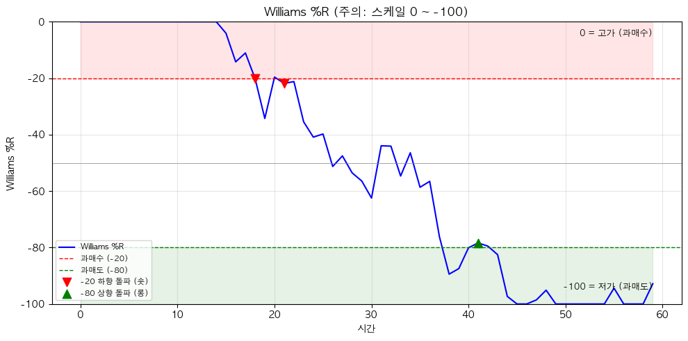

# 해외주식 Williams %R 전략 (Williams Percent Range)

## 전략 ID
`WilliamsR`

## 전략 기여자
ProgramGarden Team

## 간단한 설명

이 전략은 **"현재 종가가 최근 고점/저점 사이에서 어디쯤 있는지"를 알려주는 도구**입니다.

%R이 -20 근처면 **"고점에 가깝다 (과매수)"**, -80 근처면 **"저점에 가깝다 (과매도)"**를 의미합니다. 스토캐스틱 지표와 매우 유사하지만, 역방향(-100 ~ 0)으로 표시되는 것이 특징입니다.

## 📊 Williams %R 시각화

### Williams %R 신호 패턴

-80 이하에서 상승하면 **롱**, -20 이상에서 하락하면 **숏** 신호입니다.
(주의: 스케일이 0 ~ -100으로 RSI와 반대!)



## 이 전략이 필요한 이유

- 주가가 오르고 있을 때 **"지금이 고점인지 아닌지"** 판단이 어렵습니다.
- Williams %R은 최근 가격 범위 내에서 **현재 위치를 직관적으로** 보여줍니다.
- -20 이상이면 "최근 고점에 가깝다", -80 이하면 "최근 저점에 가깝다"고 바로 알 수 있습니다.
- **빠른 반응 속도**로 단기 매매 타이밍을 잡는 데 유용합니다.

## 전략 상세 설명

### 먼저, 용어를 간단히 정리해 볼게요

- **Williams %R**
    - "현재 종가가 최근 N일 중 어디에 있는가"를 -100 ~ 0 사이로 나타냅니다.
    - 왜 음수냐면? 원래 공식이 그렇게 만들어졌습니다. (고점 기준으로 얼마나 떨어졌는지 측정)
    - **-100**: 최근 최저점과 같다 (바닥)
    - **0**: 최근 최고점과 같다 (천장)

- **과매수 구간 (Overbought)**
    - %R이 **-20 ~ 0** 사이에 있을 때입니다.
    - "현재 가격이 최근 고점에 매우 가깝다"는 뜻입니다.
    - 하락 가능성을 염두에 둬야 합니다 (단, 강한 상승장에서는 계속 유지될 수 있음).

- **과매도 구간 (Oversold)**
    - %R이 **-100 ~ -80** 사이에 있을 때입니다.
    - "현재 가격이 최근 저점에 매우 가깝다"는 뜻입니다.
    - 반등 가능성을 염두에 둬야 합니다 (단, 강한 하락장에서는 계속 유지될 수 있음).

- **중간 영역**
    - %R이 **-80 ~ -20** 사이에 있을 때입니다.
    - 특별히 과열되거나 침체된 상태가 아닙니다.

### 계산 방식 이해하기

```
%R = (최고가 - 현재 종가) / (최고가 - 최저가) × (-100)

예시: 최근 14일간 최고가 150, 최저가 100, 현재 종가 140
%R = (150 - 140) / (150 - 100) × (-100) = -20

→ 최근 범위의 상단 20% 위치에 있음 (고점에 가까움)
```

### 어떤 방식으로 동작하나요?

1. **데이터 수집**
    - LS증권 OpenAPI로부터 가격 데이터를 받아옵니다.

2. **최고가/최저가 계산**
    - 설정한 기간(기본 14일) 동안의 최고가와 최저가를 찾습니다.

3. **%R 계산**
    - 현재 종가가 그 범위 내 어디에 있는지 계산합니다.

4. **신호 판단**
    - %R > -20: **과매수 (overbought)**
    - %R < -80: **과매도 (oversold)**

### 방향성은 이렇게 해석하세요

- **매도 고려 (과매수 탈출)**
    - %R이 -20 이상(과매수)에 있다가 -20 아래로 떨어지면
    - "고점에서 내려오기 시작했다" → 매도 타이밍

- **매수 고려 (과매도 탈출)**
    - %R이 -80 이하(과매도)에 있다가 -80 위로 올라오면
    - "저점에서 올라오기 시작했다" → 매수 타이밍

- **추세 확인**
    - %R이 계속 -20 근처에 머물면: 강한 상승 추세
    - %R이 계속 -80 근처에 머물면: 강한 하락 추세

### 활용 시나리오

- 단기 트레이딩에서 **빠른 진입/청산 타이밍**을 잡고 싶을 때
- RSI나 스토캐스틱과 비슷한 신호를 원하지만 **더 빠른 반응**을 원할 때
- 여러 종목 중 **과매도된 저가 매수 후보**를 찾고 싶을 때

## DSL 예시

```python
{
    "condition_id": "WilliamsR",
    "params": {
        "appkey": "발급받은 LS증권 키",
        "appsecretkey": "발급받은 LS증권 시크릿",
        "period": 14,
        "overbought": -20,
        "oversold": -80,
        "timeframe": "days",
        "qrycnt": 200
    }
}
```

## 파라미터 설명

| 이름 | 타입 | 기본값 | 설명 |
| --- | --- | --- | --- |
| `appkey` | str | - | LS증권에서 발급받은 Open API 키입니다. |
| `appsecretkey` | str | - | LS증권에서 발급받은 Open API 시크릿입니다. |
| `period` | int | 14 | %R 계산 기간입니다. 14일이 표준입니다. 짧게 하면 더 민감해집니다. |
| `overbought` | int | -20 | 이 값 이상이면 "과매수"로 판단합니다. |
| `oversold` | int | -80 | 이 값 이하면 "과매도"로 판단합니다. |
| `timeframe` | str | "days" | 캔들 주기입니다. `"days"`, `"weeks"`, `"months"` 중 선택 |
| `qrycnt` | int | 200 | 불러올 캔들 개수입니다. |

## 응답 데이터 설명

| 필드 | 설명 |
| --- | --- |
| `signal` | 현재 신호입니다. `"overbought"`, `"oversold"`, `"neutral"` |
| `williams_r` | 현재 %R 값입니다 (-100 ~ 0). |
| `highest_high` | 기간 내 최고가입니다. |
| `lowest_low` | 기간 내 최저가입니다. |
| `current_price` | 현재 종가입니다. |
| `exit_overbought` | 과매수 탈출 여부입니다. `true`면 매도 타이밍 신호 |
| `exit_oversold` | 과매도 탈출 여부입니다. `true`면 매수 타이밍 신호 |

## 신호 해석 가이드

| 신호 | 조건 | 일반적인 대응 |
| --- | --- | --- |
| `overbought` | %R > -20 | 주의! 하락 가능성. 단, 강한 상승세에서는 유지될 수 있음 |
| `oversold` | %R < -80 | 주목! 반등 가능성. 단, 강한 하락세에서는 유지될 수 있음 |
| `exit_overbought` | 과매수에서 탈출 | **매도 타이밍** (고점에서 내려오기 시작) |
| `exit_oversold` | 과매도에서 탈출 | **매수 타이밍** (저점에서 올라오기 시작) |
| `neutral` | -80 < %R < -20 | 관망, 특별한 신호 없음 |

## Williams %R vs 스토캐스틱

| 항목 | Williams %R | 스토캐스틱 %K |
| --- | --- | --- |
| 범위 | -100 ~ 0 | 0 ~ 100 |
| 과매수 | -20 이상 | 80 이상 |
| 과매도 | -80 이하 | 20 이하 |
| 관계 | %R = %K - 100 | %K = %R + 100 |
| 반응 속도 | 빠름 | %D 사용 시 느림 |

→ 사실상 같은 지표이지만, 표현 방식이 다릅니다!

## 전략 사용 시 주의사항

- **과매수 = 즉시 매도가 아닙니다**. 강한 상승 추세에서는 %R이 -20 근처에서 오래 머물 수 있습니다.
- **과매도 = 즉시 매수가 아닙니다**. 강한 하락 추세에서는 %R이 -80 근처에서 오래 머물 수 있습니다.
- 과매수/과매도 구간에 **"진입"**보다 **"탈출"**하는 순간이 더 중요한 신호입니다.
- 다른 지표(RSI, MACD, 이동평균 등)와 함께 사용하면 신뢰도가 높아집니다.
- 변동성이 큰 종목에서는 **기간을 늘려서 (예: 21일)** 노이즈를 줄이는 것이 좋습니다.
